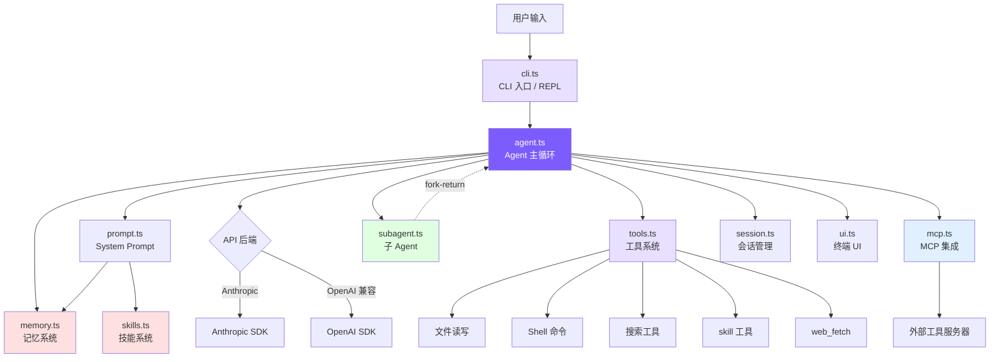

# 引言：从一个空循环开始，造一个 Claude Code

## 本章目标

说清楚这个项目做什么、为什么值得从零造、造完是什么样，然后五分钟把它跑起来。

## 从「给建议」到「自己动手」

AI 辅助编程走过三个阶段：代码补全（Copilot）、聊天助手（Cursor Chat）、自主 Agent（Claude Code）。前两个阶段有个共同的天花板——模型只能给建议，不能自己动手。让它改 bug，它给出一段代码，但它跑不了测试、看不到报错、没法根据结果再改一版。

Claude Code 迈过了这道坎。一句「给这个项目加用户注册」，它会自己去搜路由、读数据库模型、建 handler、写测试、跑 `npm test`、看到失败、改一版、再跑，来回十几轮，直到测试通过。它不是在补全代码，而是在执行一个任务。

能做到这一点，靠的不是什么复杂魔法，而是一个循环：

```
while (true) {
    调模型，拿到它的回复
    回复里有工具调用？→ 执行工具，把结果喂回去，继续
    回复只是文本？→ 任务结束，退出
}
```

传统程序里，下一步做什么是程序员用 `if/else` 提前写死的。这个循环反了过来：下一步做什么由模型决定，代码只负责把循环转起来、把工具递过去。这一个反转，就是 coding agent 和普通聊天机器人的全部区别。

## 为什么从零造，而不是读源码

真实的 Claude Code 把这个循环包在了五十万行 TypeScript 里——66 个工具、一套 React/Ink 终端界面、MCP 协议、OAuth 认证、多代理系统。直接翻这些代码，很容易淹死在边界情况和抽象层里，读完还是说不清那个循环长什么样。

这个项目反过来做：把那个循环单独拎出来，用最小的代码重造一遍，一块一块搭。起点是十几行、只会聊天的循环；每一章补一块能力，每一块都能单独跑起来。搭到最后是一个能读代码、改文件、跑测试、循环着修到通过的 agent，TypeScript 版约 5500 行，Python 版约 5000 行，两者互为镜像。就像用一台卡丁车理解汽车：引擎、方向盘、刹车都在，空调和音响先不装，但每一颗关键的螺丝都拧得清清楚楚。

## 各章造出什么

这张表是核心构建线。每一行是一章，右边是那一章结束时 agent 新学会的事——从「只会聊天」一路长到「能自己干活」：

| 章节 | 这一章之后，agent 能…… |
|---|---|
| 1. Agent Loop | 调用工具、把结果喂回自己，不再只是聊天 |
| 2. 工具系统 | 读写文件、跑 Shell、搜代码——真正动手改项目 |
| 3. System Prompt | 知道自己在什么系统、什么目录、什么 Git 状态下干活 |
| 4. CLI 与会话 | 有一个能交互的命令行，对话还能存盘、`--resume` 接着聊 |
| 5. 流式输出 | 一边生成一边显示，还能接 OpenAI 兼容的模型 |
| 6. 权限与安全 | 危险操作先问一句，deny 规则拦得住越界 |
| 7. 上下文管理 | 对话太长会自动压缩，跑几十轮也不撑爆窗口 |
| 8. 记忆系统 | 跨会话记住偏好和项目事实，用得上时自己捞出来 |
| 9. 技能系统 | 把常用操作打包成可复用的技能，随用随调 |
| 10. Plan Mode | 先只读地拿出方案，批准了再动手 |
| 11. 多 Agent | 任务太大就 fork 一个子 Agent 去啃，啃完把结果带回来 |
| 12. MCP 集成 | 接上外部工具服务器，工具集能往外扩 |
| 13. 架构对比 | 和真实 Claude Code 逐项对照，看清最小实现和生产级差在哪 |

这条线之外还有两章：第 14 章用 22 个手动场景验收 agent 是否真跑得通，第 15 章加上「自治」三件套（`/goal`、`/loop`、Auto Mode），让 agent 能自己持续推进任务、逐动作裁决权限。

## 最终的样子

搭到最后，各个部件是这样接在一起的。这里不必看懂每个框，后面每一章会补上其中一块：



主线一句话：用户输入进来，CLI 交给 Agent Loop，模型决定调哪个工具，代码执行完把结果喂回去，循环到模型说「做完了」为止。中间的 `agent.ts` 是引擎（约 2169 行），组装消息、调 API、编排工具、压缩上下文、控制预算都在这儿；其余文件各管一摊，规模都不大：

| 文件 | 行数 | 管什么 |
|------|------|------|
| `agent.ts` | ~2169 | Agent 主循环：消息构造、API 调用、工具编排、流式执行、子 Agent、4 层压缩、预算、Plan Mode、自治三件套 |
| `tools.ts` | ~884 | 工具定义与执行：12 个常驻工具、6 种权限模式、mtime 防护、延迟加载（`/loop` dynamic 期间还会临时挂载 `schedule_wakeup`） |
| `autonomy.ts` | ~464 | 自治三件套：`/goal` 评估器、`/loop` 调度、Auto Mode 分类器 |
| `cli.ts` | ~416 | CLI 入口、参数解析、REPL 交互 |
| `memory.ts` | ~392 | 记忆系统：4 类型、文件存储、语义召回、异步预取 |
| `mcp.ts` | ~277 | MCP 客户端：JSON-RPC over stdio、工具发现与转发 |
| `prompt.ts` | ~253 | System Prompt 构造：模板、@include、变量替换、记忆/技能注入 |
| `ui.ts` | ~215 | 终端输出：颜色、格式化 |
| `subagent.ts` | ~199 | 子 Agent 配置：3 内置类型 + 自定义 Agent 发现 |
| `skills.ts` | ~175 | 技能系统：目录发现、frontmatter 解析、inline/fork 双模式 |
| `session.ts` | ~63 | 会话持久化：JSON 文件存储 |
| `frontmatter.ts` | ~41 | YAML frontmatter 解析 |

Python 版是同一套结构的完整镜像，放在 `python/mini_claude/` 包里，约 5000 行。

## 技术栈

依赖少到可以一眼看完，没有框架，也没有构建工具链。

<!-- tabs:start -->
#### **TypeScript**

```
TypeScript           — 类型安全，和 Claude Code 同语言
@anthropic-ai/sdk    — Anthropic 官方 SDK
openai               — OpenAI 兼容后端支持
chalk                — 终端颜色输出
glob                 — 文件模式匹配
```

#### **Python**

```
Python 3.11+         — 简洁易读
anthropic            — Anthropic 官方 SDK
openai               — OpenAI 兼容后端支持
```
<!-- tabs:end -->

## 先跑起来

装好、给一个 API key、跑起来，五分钟的事。

<!-- tabs:start -->
#### **TypeScript**

```bash
git clone https://github.com/Windy3f3f3f3f/claude-code-from-scratch.git
cd claude-code-from-scratch
npm install
export ANTHROPIC_API_KEY=sk-ant-xxx
npm run dev
```

#### **Python**

```bash
git clone https://github.com/Windy3f3f3f3f/claude-code-from-scratch.git
cd claude-code-from-scratch/python
pip install -e .
export ANTHROPIC_API_KEY=sk-ant-xxx
mini-claude-py "hello"
```
<!-- tabs:end -->

启动后是这样：

```
  Mini Claude Code — A minimal coding agent

  Type your request, or 'exit' to quit.
  Commands: /clear /cost /compact /memory /skills /plan

>
```

试一句 `read src/agent.ts and explain the main loop`，看它自己读文件、自己讲。

命令行还有这些开关，后面对应的章节会讲各自怎么实现：

```bash
mini-claude --yolo "run all tests"          # 跳过所有确认
mini-claude --plan "analyze this codebase"  # 只分析不修改
mini-claude --accept-edits "refactor"       # 自动批准文件编辑
mini-claude --dont-ask "check style"        # 需确认的操作自动拒绝
mini-claude --auto "fix the failing test"   # Auto Mode：分类器逐动作裁决权限
mini-claude --thinking "analyze this bug"   # 启用 Extended Thinking
mini-claude --resume                        # 恢复上次会话
mini-claude --max-cost 0.50 --max-turns 20  # 预算控制
```

## 各章去哪找对应源码

每一章讲最小实现怎么造，也会指出真实 Claude Code 里对应的源码位置，方便造完之后回去对照：

| 章节 | mini-claude 文件 | Claude Code 对应源码 |
|------|-----------------|---------------------|
| **Phase 1: 构建一个可用的 Coding Agent** | | |
| [1. Agent Loop](docs/01-agent-loop.md) | `agent.ts` 的 `chatAnthropic()` | `src/query.ts` 的 `queryLoop` |
| [2. 工具系统](docs/02-tools.md) | `tools.ts` | `src/Tool.ts` + `src/tools/` (66+ 工具) |
| [3. System Prompt](docs/03-system-prompt.md) | `prompt.ts` | `src/constants/prompts.ts` |
| [4. CLI 与会话](docs/04-cli-session.md) | `cli.ts` + `session.ts` | `src/entrypoints/cli.tsx` |
| [5. 流式输出](docs/05-streaming.md) | `agent.ts` 的两套 stream 方法 | `src/services/api/claude.ts` |
| [6. 权限与安全](docs/06-permissions.md) | `tools.ts` 的 `checkPermission()` + 规则配置 | `src/utils/permissions/` (52KB) |
| [7. 上下文管理](docs/07-context.md) | `agent.ts` 的 `checkAndCompact()` | `src/services/compact/` |
| **Phase 2: 进阶能力** | | |
| [8. 记忆系统](docs/08-memory.md) | `memory.ts` | `src/utils/memory.ts` |
| [9. 技能系统](docs/09-skills.md) | `skills.ts` | `src/utils/skills.ts` + `src/tools/SkillTool/` |
| [10. Plan Mode](docs/10-plan-mode.md) | `agent.ts` + `tools.ts` + `cli.ts` | `EnterPlanMode` / `ExitPlanMode` |
| [11. 多 Agent](docs/11-multi-agent.md) | `subagent.ts` + `agent.ts` | `src/tools/AgentTool/` |
| [12. MCP 集成](docs/12-mcp.md) | `mcp.ts` | `src/services/mcpClient.ts` |
| [13. 架构对比](docs/13-whats-next.md) | 全局对比 | 全局对比 |
| **Phase 3: 自主运行** | | |
| [15. 自治与续跑](docs/15-autonomy.md) | `autonomy.ts` | `/goal` · `/loop` · Auto Mode |

---

> **下一章**：从最笨的循环开始——一个只会聊天的 while，再一步步把它变成能干活的 agent。
