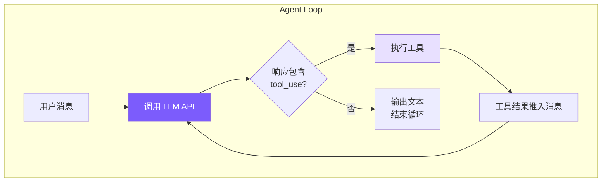

# 1. Agent Loop — 核心循环

## 本章目标

造出 coding agent 的心脏：一个循环，不停地「调模型 → 看它要不要用工具 → 用完把结果喂回去 → 再调模型」，直到模型说任务做完了。

起点只有一个十几行的循环，第一次跑它只会聊天、读不了文件；补上一小段工具回路，读文件这类活才走得通。走完这一步，再回头看真实 Claude Code 的循环，多出来的复杂都在解决什么就清楚了。



> ▶ **跑这一章**：`node steps/run.mjs 1`（无需 API key，走本地 mock 模型）。加 `--py` 跑 Python 版。想拿自己的 prompt 连真实模型，就加 `--live`（读 `.env` 里的 key）。

## 第一版：一个只会聊天的循环

先写出最笨的版本。把用户的话加进消息数组，调一次模型，把回复打印出来——就这些：

```typescript
async function chatOnce(messages, userMessage) {
  messages.push({ role: "user", content: userMessage });

  const response = await client.messages.create({
    model: "claude-...",
    max_tokens: 4096,
    messages,
  });

  const text = response.content.find(b => b.type === "text")?.text ?? "";
  console.log(text);
  messages.push({ role: "assistant", content: response.content });
}
```

跑起来它确实能聊天。问它「解释一下什么是快速排序」，答得头头是道。可一旦让它干正事，问题就来了：

```
> 读一下 src/agent.ts，讲讲主循环
我没有办法直接读取你的文件。如果你把内容贴过来，我可以帮你分析……
```

不是它不肯，是根本没给它手。模型只能吐出文本，而这段代码只会把文本打印掉。它想读文件、想跑命令，可这条路一步都走不通——请求里没告诉它有哪些工具，就算它想调，也没有接住它、真去执行、再把结果递回去的那一环。

## 给循环装上手：工具回路

要让模型能动手，只差两件事。一是在请求里带上工具清单，告诉它有哪些工具可调——第 1 章先只给一个 `read_file`，下一章再补齐写文件、跑命令等；二是当它回复里带着「我要调 read_file」时，我们真的去执行，把结果作为下一条消息喂回去，然后再调一次模型，让它接着往下走。

这两件事就是那个 `while` 循环的由来。把上面的 `chatOnce` 改成这样：

```typescript
async function chat(messages, userMessage) {
  messages.push({ role: "user", content: userMessage });

  while (true) {
    const response = await client.messages.create({
      model: "claude-...",
      max_tokens: 4096,
      messages,
      tools: toolDefinitions,   // ← 就多这一行：把工具清单发过去，模型才知道有哪些工具能调
    });
    messages.push({ role: "assistant", content: response.content });

    // 挑出模型这一轮想调用的工具
    const toolUses = response.content.filter(b => b.type === "tool_use");
    if (toolUses.length === 0) break;   // 一个都没调 → 它认为任务完成了，退出

    // 逐个执行，把结果收集起来
    const toolResults = [];
    for (const toolUse of toolUses) {
      printToolCall(toolUse.name, toolUse.input);
      const result = await executeTool(toolUse.name, toolUse.input);
      printToolResult(toolUse.name, result);
      toolResults.push({ type: "tool_result", tool_use_id: toolUse.id, content: result });
    }

    // 结果作为一条 user 消息喂回去，循环回到开头，模型接着往下想
    messages.push({ role: "user", content: toolResults });
  }
}
```

比第一版多的就两处：请求里多了 `tools: toolDefinitions`（让模型知道有哪些工具），外面套了个 `while`（工具跑完把结果喂回去、再问一轮）。刚才读不了文件的同一个问题，现在走得通了。

**决定循环转不转的，从头到尾是模型，不是我们的代码。** 我们没写任何「如果是读文件请求就……」的分支——是模型自己决定这一步要不要动手、动手之后够不够、要不要再来一轮。这一点就是 agent 和聊天机器人的分界线。

到这里，可运行的最小版就成型了。上面为讲清概念用的是几个自由函数，真代码把它们收进一个 `Agent` 类，对应关系就三点：`messages` 变成实例上的 `this.messages`、`client` 收进 `Agent` 构造函数、`executeTool` 和 `toolDefinitions` 从 `tools.ts` 引进来（第 1 章的 `tools.ts` 里只有 `read_file`，下一章补齐其余工具）。下面这段就是 steps 里第 1 章的 `Agent.chat`，两种语言一一对应，真能跑：

<!-- tabs:start -->
#### **TypeScript**
<!-- @snippet lang=ts file=agent.ts region=loop step=1 -->
```typescript
async chat(userText: string): Promise<void> {
  this.messages.push({ role: "user", content: userText });

  while (true) {
    let system = SYSTEM_PROMPT;
    // Build the request once. Passing `tools` is the one line that makes the
    // model tool-aware. Chapter 5 turns the call itself into a stream.
    const request = {
      model: MODEL,
      max_tokens: 4096,
      system,
      tools: toolDefinitions,
      messages: this.messages,
    };

    const reply = await this.client.messages.create(request);
    for (const block of reply.content) {
      if (block.type === "text") process.stdout.write(block.text);
    }
    process.stdout.write("\n");

    // Record the assistant's full reply (text + any tool calls).
    this.messages.push({ role: "assistant", content: reply.content });

    const toolUses = reply.content.filter(
      (b): b is Anthropic.ToolUseBlock => b.type === "tool_use"
    );
    // No tool calls means the model is done with this turn.
    if (toolUses.length === 0) return;

    // Run every requested tool and send the outputs back as one user message.
    const results: Anthropic.ToolResultBlockParam[] = [];
    for (const tu of toolUses) {
      console.log(`  → ${tu.name}(${JSON.stringify(tu.input)})`);
      const output = await executeTool(tu.name, tu.input as Record<string, any>);
      results.push({ type: "tool_result", tool_use_id: tu.id, content: output });
    }
    this.messages.push({ role: "user", content: results });
  }
}
```
<!-- @endsnippet -->
#### **Python**
<!-- @snippet lang=py file=agent.py region=loop step=1 -->
```python
def chat(self, user_text: str) -> None:
    self.messages.append({"role": "user", "content": user_text})

    while True:
        system = SYSTEM_PROMPT
        tools = tool_definitions
        kwargs = dict(model=MODEL, max_tokens=4096, system=system, tools=tools, messages=self.messages)

        reply = self.client.messages.create(**kwargs)
        for block in reply.content:
            if block.type == "text":
                print(block.text, end="", flush=True)
        print()

        # Record the assistant's full reply (text + any tool calls).
        self.messages.append({"role": "assistant", "content": reply.content})

        tool_uses = [b for b in reply.content if b.type == "tool_use"]
        # No tool calls means the model is done with this turn.
        if not tool_uses:
            return

        # Run every requested tool; send the outputs back as one user message.
        results = []
        for tu in tool_uses:
            print(f"  → {tu.name}({json.dumps(tu.input)})")
            output = execute_tool(tu.name, tu.input)
            results.append({"type": "tool_result", "tool_use_id": tu.id, "content": output})
        self.messages.append({"role": "user", "content": results})
```
<!-- @endsnippet -->
<!-- tabs:end -->

▶ 现在就跑它（不用 API key，走本地 mock 模型）：

<!-- @transcript step=1 lang=ts -->
```
$ node steps/run.mjs 1
▶ step 1 demo (no API key — local mock model)   sandbox: <sandbox>
  you: Read the file greeting.txt and tell me what it says.


  → read_file({"file_path":"greeting.txt"})
greeting.txt says: hello from step one.
```
<!-- @endtranscript -->

模型收到「读 greeting.txt」，回了一句「我要调 read_file」；循环没有停，而是真去读了文件、把内容作为 user 消息喂回去、再调一次模型，这次它才给出答案。真实的 `agent.ts` 在这之上还叠了记忆预取、上下文压缩、流式提前执行等等，都是后面几章一层层加进去的——本章末尾再看那些。

## 消息数组是怎么长大的

理解这个循环，关键在看懂消息数组每一轮怎么变长：

```
第 1 轮:
  messages = [
    { role: "user",      content: "帮我修复 bug" }
    { role: "assistant", content: [text + tool_use(read_file)] }
    { role: "user",      content: [tool_result("文件内容...")] }
  ]

第 2 轮（模型看到文件内容后决定编辑）:
  messages = [
    ...前 3 条,
    { role: "assistant", content: [text + tool_use(edit_file)] }
    { role: "user",      content: [tool_result("编辑成功")] }
  ]

第 3 轮（模型认为任务完成）:
  messages = [
    ...前 5 条,
    { role: "assistant", content: [text("已修复!")] }  ← 无 tool_use → break
  ]
```

带工具的那几轮，数组通常多两条：一条 assistant（模型要调的工具），一条 user（工具结果）；最后收尾那轮模型不再调工具，只多一条 assistant 文本。模型每次都能看到从头到尾的完整历史，这就是它能「记得」自己之前做过什么的原因——所谓记忆，此刻不过是一个不断变长的数组。工具结果之所以用 `role: "user"` 装，是 Anthropic API 的协议要求，而且每条结果必须靠 `tool_use_id` 认回它对应的那次调用。

## 收尾：让它能停下来

本章的最小版还没处理中断——按 Ctrl+C 让它中途优雅停下来，是第 4 章接上 CLI 时才补的事。真实 Claude Code 用一个 `AbortController` 贯穿整个循环：`abort()` 一调，signal 变 `aborted`，循环在下一个检查点退出，连正在飞的那次网络请求也一起取消；Python 侧没有 `AbortController`，用一个标志加取消当前 asyncio task 达到同样效果。

## 真实 Claude Code 比这多做了什么

上面那个循环，判断逻辑只有一条：有 tool_use 就继续，没有就停。真实的 Claude Code 处理的情况要多得多——把它的循环拆开看，正好照出一个玩具循环和一个生产级引擎之间隔着哪些东西。

> 下面这些结构（层次、模块名、大致行数）来自对公开版本的分析，Anthropic 官方文档能坐实的只是 tool_use / tool_result 这条工具回路本身；内部实现细节会随版本变化，具体的名字和行数看看趋势就好，别当精确事实。

它把一层循环拆成了两层。外层 `QueryEngine`（约 1155 行）管整个对话的生命周期：用户输入、USD 预算、Token 统计、会话恢复；内层 `queryLoop`（约 1728 行）只管一次查询怎么执行：消息压缩、API 调用、工具执行、错误恢复。这样拆是为了关注点分离——外层不必操心「PTL 错误怎么恢复」，内层不必操心「用户输入怎么解析」。

它的内层循环是个异步生成器（`async function*`）。选生成器而不是回调，图的是两点：一是背压，消费端没处理完，生产端就不往下生成，天然不会堆积事件；二是控制流是线性的，所有分支都用普通的 `continue` / `break` 表达，不用写状态机。

「继续循环」这件事，它分了七种情况。最小版只有一种（有 tool_use 就继续），它有七种：

| # | 名称 | 什么时候 | 怎么办 |
|---|------|---------|-------|
| 1 | `next_turn` | 模型调了工具 | 执行工具，结果推回，继续 |
| 2 | `collapse_drain_retry` | PTL 错误，有暂存的折叠操作 | 提交折叠腾空间，重试 |
| 3 | `reactive_compact_retry` | PTL 错误，折叠空间还不够 | 强制全量摘要压缩，重试 |
| 4 | `max_output_tokens_escalate` | 输出被截断，第一次 | 升到更高 Token 上限（16K→64K），重试 |
| 5 | `max_output_tokens_recovery` | 输出被截断，升级已用尽 | 注入续写提示，最多重试 3 次 |
| 6 | `stop_hook_blocking` | 任务做完但 Stop Hook 拦下了 | 接着执行循环 |
| 7 | `token_budget_continuation` | API 侧 Token 预算耗尽 | 继续生成 |

我们只实现第 1 种，其余六种都是各类错误和边界的恢复策略。

可恢复的错误，它先扣着不往上抛。输出被截断时，如果直接把错误 yield 给外层，界面就会跳报错——可内层循环后面的恢复逻辑其实能自己处理。所以它先「扣留」这个错误，跑一遍恢复；成功了用户完全无感，失败了才最终暴露。大多数 `max_output_tokens` 和 `prompt_too_long` 就是这样被静默消化掉的。

它在流式响应还没结束时就开始执行工具。一个典型响应有 5 到 30 秒的流式窗口，Claude Code 用 `StreamingToolExecutor` 抓住这段时间：某个工具的参数 JSON 一旦拼完整，立刻开跑，不等整个响应收完。

```
串行（本章最小版，暂时串行）：
  [========= API 流式响应 =========][tool1][tool2][tool3]

并行（Claude Code）：
  [========= API 流式响应 =========]
       ↑ tool1 的 JSON 完成 → 立即执行
            ↑ tool2 的 JSON 完成 → 立即执行
```

这些都是「怎么把同一个循环做得又稳又快」的工程。地基却是同一个——上面那个最小循环，就是它们全部长在上面的地基。

---

> **下一章**：循环的动力全在工具。没有工具，模型还是只能说话不能做事。下一章我们把工具系统做全，让 agent 真正能改文件、跑命令、搜代码。
