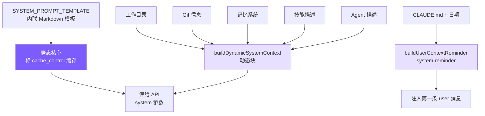

# 3. System Prompt 工程

## 本章目标

上一章 agent 有了一手工具，可它还不知道自己是谁、在什么环境里干活、什么时候该谨慎——这些都写在 System Prompt 里，也就是每次调模型前拼进去的第一段话。这一章造它。

拆成两半：一半是静态核心，写身份、规则、工具偏好，跨会话逐字不变（正好能被缓存，第 7 章会用上这点）；另一半每次动态拼，塞进当下的环境事实——操作系统、当前目录、Git 状态、项目自己的 `CLAUDE.md`。



> ▶ **跑这一章**：`node steps/run.mjs 3`（无需 API key）。加 `--diff` 看它比上一章多了什么。

## 我们的实现

上一章的 agent 用的还是一句写死的 system prompt。这一章造 `prompt.ts`，给它一份真正的静态核心（身份、规则、工具偏好）加一段动态环境。相对上一章，`agent.ts` 里就换了一行——把写死的那句换成 `buildSystemPrompt()`：

<!-- @diff file=agent.ts step=3 lang=ts -->
```diff
@@ -1,12 +1,8 @@
 import Anthropic from "@anthropic-ai/sdk";
 import { toolDefinitions, executeTool } from "./tools.js";
+import { buildSystemPrompt } from "./prompt.js";
 
 const MODEL = process.env.MINI_MODEL || "claude-sonnet-4-5-20250929";
 
-// A minimal, hard-coded system prompt. Chapter 3 replaces this with a real
-// static-core-plus-environment prompt built in prompt.ts.
-const SYSTEM_PROMPT =
-  "You are Mini Claude Code, a small coding assistant that helps with software " +
-  "tasks. Use the tools to read and change files. Keep answers short.";
 
 // The whole agent is one class holding a growing message array and a loop.
@@ -35,5 +31,5 @@ export class Agent {
         model: MODEL,
         max_tokens: 4096,
-        system: SYSTEM_PROMPT,
+        system: buildSystemPrompt(),
         tools: toolDefinitions,
         messages: this.messages,
```
<!-- @enddiff -->

跑一下，它现在带着完整的 system prompt 干活：

<!-- @transcript step=3 lang=ts -->
```
$ node steps/run.mjs 3
▶ step 3 demo (no API key — local mock model)   sandbox: <sandbox>
  you: Read the file greeting.txt and tell me what it says.


  → read_file({"file_path":"greeting.txt"})
greeting.txt says: hello from step one.
```
<!-- @endtranscript -->

### SYSTEM_PROMPT_TEMPLATE

模板内联在 `prompt.ts` 中。它就是静态核心本身——不含任何插值，跨会话逐字节不变，这正是它能被缓存的前提：

<!-- tabs:start -->
#### **TypeScript**
<!-- @snippet lang=ts file=prompt.ts region=static_core step=3 -->
```typescript
const STATIC_CORE = `You are Mini Claude Code, a small coding assistant CLI.
You help with software engineering tasks using the tools available to you.

# Doing tasks
 - Do not propose changes to code you haven't read. Read files first.
 - Do not create files unless necessary. Prefer editing existing files.
 - Avoid over-engineering. Only make changes that were requested.

# Executing actions with care
 - Prefer reversible actions. For risky or destructive ones (rm -rf, git push,
   dropping tables), confirm with the user before proceeding.

# Using your tools
 - Use read_file / edit_file / list_files / grep_search instead of shell cat,
   sed, ls, grep. Reserve run_shell for actual shell operations.
 - If several tool calls are independent, make them in parallel.

# Tone and style
 - Keep responses short and concise. Lead with the answer.
 - Reference code as file_path:line_number.`;
```
<!-- @endsnippet -->
#### **Python**
<!-- @snippet lang=py file=prompt.py region=static_core step=3 -->
```python
STATIC_CORE = """You are Mini Claude Code, a small coding assistant CLI.
You help with software engineering tasks using the tools available to you.

# Doing tasks
 - Do not propose changes to code you haven't read. Read files first.
 - Do not create files unless necessary. Prefer editing existing files.
 - Avoid over-engineering. Only make changes that were requested.

# Executing actions with care
 - Prefer reversible actions. For risky or destructive ones (rm -rf, git push,
   dropping tables), confirm with the user before proceeding.

# Using your tools
 - Use read_file / edit_file / list_files / grep_search instead of shell cat,
   sed, ls, grep. Reserve run_shell for actual shell operations.
 - If several tool calls are independent, make them in parallel.

# Tone and style
 - Keep responses short and concise. Lead with the answer.
 - Reference code as file_path:line_number."""
```
<!-- @endsnippet -->
<!-- tabs:end -->

模板到这里就结束了——它只含**静态核心**：所有用户、所有会话都完全相同的角色定义、规则和工具说明。环境上下文（cwd、platform、shell、git 状态、记忆、技能、agent 列表）由 `buildDynamicSystemContext()` 单独构建成动态块，跟在静态块后面；CLAUDE.md 和当前日期则包成 `<system-reminder>` 注入第一条 user 消息。这样切分是给前缀缓存让路：静态核心标上 `cache_control` 后跨会话字节不变、稳定命中，而因项目而异的内容不去污染它（详见[第 7 章：前缀缓存](07-context.md)）。记忆、技能、agent 列表放在动态块末尾——近因效应，这些内容的权重更大（详见第 8、9 章）。

### prompt.ts 实现

<!-- tabs:start -->
#### **TypeScript**
```typescript
import { readFileSync, existsSync } from "fs";
import { join, resolve } from "path";
import { execSync } from "child_process";
import * as os from "os";
import { buildMemoryPromptSection } from "./memory.js";
import { buildSkillDescriptions } from "./skills.js";
import { buildAgentDescriptions } from "./subagent.js";
import { getDeferredToolNames } from "./tools.js";

export function loadClaudeMd(): string {
  const parts: string[] = [];
  let dir = process.cwd();
  while (true) {
    const file = join(dir, "CLAUDE.md");
    if (existsSync(file)) {
      try {
        let content = readFileSync(file, "utf-8");
        content = resolveIncludes(content, dir);  // @include 解析
        parts.unshift(content);
      } catch {}
    }
    const parent = resolve(dir, "..");
    if (parent === dir) break;
    dir = parent;
  }
  const rules = loadRulesDir(process.cwd());  // .claude/rules/*.md
  const claudeMd = parts.length > 0
    ? "\n\n# Project Instructions (CLAUDE.md)\n" + parts.join("\n\n---\n\n")
    : "";
  return claudeMd + rules;
}

export function getGitContext(): string {
  try {
    const opts = { encoding: "utf-8" as const, timeout: 3000 };
    const branch = execSync("git rev-parse --abbrev-ref HEAD", opts).trim();
    const log = execSync("git log --oneline -5", opts).trim();
    const status = execSync("git status --short", opts).trim();
    let result = `\nGit branch: ${branch}`;
    if (log) result += `\nRecent commits:\n${log}`;
    if (status) result += `\nGit status:\n${status}`;
    return result;
  } catch {
    return "";
  }
}

// 静态核心：模板原样返回，不做任何插值——这是被 cache_control 缓存的块
export function buildStaticSystemPrompt(): string {
  return SYSTEM_PROMPT_TEMPLATE;
}

// 动态块：环境 + git + 记忆 + 技能 + agent 列表，会话内稳定但因机器/项目而异
export function buildDynamicSystemContext(): string {
  const platform = `${os.platform()} ${os.arch()}`;
  const shell = process.platform === "win32"
    ? (process.env.ComSpec || "cmd.exe")
    : (process.env.SHELL || "/bin/sh");
  return `# Environment
Working directory: ${process.cwd()}
Platform: ${platform}
Shell: ${shell}${getGitContext()}${buildMemoryPromptSection()}${buildSkillDescriptions()}${buildAgentDescriptions()}`;
}

// CLAUDE.md + 日期：包成 <system-reminder>，由 agent 注入第一条 user 消息
export function buildUserContextReminder(): string {
  const date = new Date().toISOString().split("T")[0];
  const claudeMd = loadClaudeMd();
  return `<system-reminder>\n...${claudeMd}\n# currentDate\nToday's date is ${date}.\n...</system-reminder>`;
}
```
#### **Python**
```python
import os
import platform
import subprocess
from pathlib import Path


def load_claude_md() -> str:
    parts: list[str] = []
    d = Path.cwd().resolve()
    while True:
        f = d / "CLAUDE.md"
        if f.is_file():
            try:
                content = f.read_text()
                content = resolve_includes(content, str(d))  # @include 解析
                parts.insert(0, content)
            except Exception:
                pass
        parent = d.parent
        if parent == d:
            break
        d = parent
    rules = load_rules_dir(str(Path.cwd()))  # .claude/rules/*.md
    claude_md = "\n\n# Project Instructions (CLAUDE.md)\n" + "\n\n---\n\n".join(parts) if parts else ""
    return claude_md + rules


def get_git_context() -> str:
    try:
        opts = {"encoding": "utf-8", "timeout": 3, "capture_output": True}
        branch = subprocess.run(["git", "rev-parse", "--abbrev-ref", "HEAD"], **opts).stdout.strip()
        log = subprocess.run(["git", "log", "--oneline", "-5"], **opts).stdout.strip()
        status = subprocess.run(["git", "status", "--short"], **opts).stdout.strip()
        result = f"\nGit branch: {branch}"
        if log:
            result += f"\nRecent commits:\n{log}"
        if status:
            result += f"\nGit status:\n{status}"
        return result
    except Exception:
        return ""


def build_static_system_prompt() -> str:
    # 静态核心：模板原样返回——这是被 cache_control 缓存的块
    return SYSTEM_PROMPT_TEMPLATE


def build_dynamic_system_context() -> str:
    # 动态块：环境 + git + 记忆 + 技能 + agent 列表
    plat = f"{platform.system()} {platform.machine()}"
    shell = os.environ.get("SHELL", "/bin/sh")
    return (
        f"# Environment\n"
        f"Working directory: {Path.cwd()}\n"
        f"Platform: {plat}\n"
        f"Shell: {shell}"
        f"{get_git_context()}{build_memory_prompt_section()}"
        f"{build_skill_descriptions()}{build_agent_descriptions()}"
    )


def build_user_context_reminder() -> str:
    # CLAUDE.md + 日期：包成 <system-reminder>，由 agent 注入第一条 user 消息
    from datetime import date
    return (
        "<system-reminder>\n..."
        f"{load_claude_md()}\n"
        f"# currentDate\nToday's date is {date.today().isoformat()}.\n"
        "...</system-reminder>"
    )
```
<!-- tabs:end -->

### 简化取舍

| Claude Code | mini-claude | 理由 |
|------------|-------------|------|
| Static/Dynamic 缓存边界 | 拆静态/动态 + 静态块打 `cache_control` | 见[第 7 章：前缀缓存](07-context.md) |
| CLAUDE.md 5 层发现 + .claude 子目录 | 从 CWD 向上遍历 + .claude/rules/ | 覆盖常见场景 |
| @include 指令 | 支持 @./path、@~/path、@/path | 完整实现 |
| 反模式接种（3 条规则） | 完整保留 | 对输出质量影响极大 |
| 爆炸半径框架 | 完整保留 | 安全性不能简化 |
| 工具偏好映射表 | 适配工具名保留 | 必须有，否则模型默认用 bash |
| Deferred 工具名注入 | getDeferredToolNames() | 告知模型哪些工具可按需激活 |

### @include 语法与 Rules 自动加载

CLAUDE.md 文件支持 `@` 语法引用外部文件，实现项目配置的模块化。同时，`.claude/rules/*.md` 目录下的规则文件会自动加载。

<!-- tabs:start -->
#### **TypeScript**
```typescript
// prompt.ts — @include 解析

const INCLUDE_REGEX = /^@(\.\/[^\s]+|~\/[^\s]+|\/[^\s]+)$/gm;
const MAX_INCLUDE_DEPTH = 5;

function resolveIncludes(
  content: string,
  basePath: string,
  visited: Set<string> = new Set(),
  depth: number = 0
): string {
  if (depth >= MAX_INCLUDE_DEPTH) return content;
  return content.replace(INCLUDE_REGEX, (_match, rawPath: string) => {
    let resolved: string;
    if (rawPath.startsWith("~/")) {
      resolved = join(os.homedir(), rawPath.slice(2));
    } else if (rawPath.startsWith("/")) {
      resolved = rawPath;
    } else {
      resolved = resolve(basePath, rawPath);  // ./relative
    }
    resolved = resolve(resolved);
    if (visited.has(resolved)) return `<!-- circular: ${rawPath} -->`;
    if (!existsSync(resolved)) return `<!-- not found: ${rawPath} -->`;
    try {
      visited.add(resolved);
      const included = readFileSync(resolved, "utf-8");
      return resolveIncludes(included, dirname(resolved), visited, depth + 1);
    } catch {
      return `<!-- error reading: ${rawPath} -->`;
    }
  });
}
```
<!-- tabs:end -->

三种路径格式：
- `@./relative/path` — 相对于当前 CLAUDE.md 所在目录
- `@~/path` — 相对于用户 home 目录
- `@/absolute/path` — 绝对路径

防护措施：
- **visited Set** 防止循环引用（A include B，B include A）
- **MAX_INCLUDE_DEPTH = 5** 防止嵌套过深
- 找不到文件时留下 HTML 注释标记，不报错中断

`.claude/rules/*.md` 自动加载：

<!-- tabs:start -->
#### **TypeScript**
```typescript
// prompt.ts — 规则目录加载

function loadRulesDir(dir: string): string {
  const rulesDir = join(dir, ".claude", "rules");
  if (!existsSync(rulesDir)) return "";
  const files = readdirSync(rulesDir).filter(f => f.endsWith(".md")).sort();
  const parts: string[] = [];
  for (const file of files) {
    let content = readFileSync(join(rulesDir, file), "utf-8");
    content = resolveIncludes(content, rulesDir);  // 规则文件也支持 @include
    parts.push(`<!-- rule: ${file} -->\n${content}`);
  }
  return parts.length > 0 ? "\n\n## Rules\n" + parts.join("\n\n") : "";
}
```
<!-- tabs:end -->

使用示例：

```markdown
# CLAUDE.md
@./.claude/rules/chinese-greeting.md
@./docs/coding-style.md

This project uses TypeScript with strict mode.
```

加载后，引用会被替换为文件内容。这让团队可以把共享规则放在 `.claude/rules/` 目录下，CLAUDE.md 只需一行引用。

loadClaudeMd 整合了三者：向上遍历 CLAUDE.md + @include 解析 + rules 目录：

```typescript
export function loadClaudeMd(): string {
  const parts: string[] = [];
  let dir = process.cwd();
  while (true) {
    const file = join(dir, "CLAUDE.md");
    if (existsSync(file)) {
      let content = readFileSync(file, "utf-8");
      content = resolveIncludes(content, dir);  // 每个 CLAUDE.md 都解析 @include
      parts.unshift(content);
    }
    const parent = resolve(dir, "..");
    if (parent === dir) break;
    dir = parent;
  }
  const rules = loadRulesDir(process.cwd());
  const claudeMd = parts.length > 0
    ? "\n\n# Project Instructions (CLAUDE.md)\n" + parts.join("\n\n---\n\n")
    : "";
  return claudeMd + rules;
}
```

---

## 真实 Claude Code 比这多做了什么

我们那份提示词，静态核心加一段环境信息就够用了。Claude Code 的 System Prompt 是经过大量 A/B 测试和模型行为观察迭代打磨的工程产物——多出来的部分，是把「让模型稳定照做」这件事做到了极致。

### 7 层递进结构

提示词从抽象到具体分为 7 层——**先建立身份和约束框架，再填充具体行为指导**。这个顺序很重要：模型先建立的概念会成为理解后续内容的框架。

```
1. Identity   → 我是谁？interactive agent
2. System     → 运行环境的基本事实
3. Doing Tasks → 怎么写代码？（反模式接种）
4. Actions    → 哪些操作需要确认？（爆炸半径框架）
5. Using Tools → 怎么用工具？（偏好映射表）
6. Tone & Style → 输出什么格式？
7. Output Efficiency → 怎么更简洁？
```

### 反模式接种

**明确告诉模型"不要做什么"，比只描述"要做什么"有效得多。**

正面指令（"be concise"）给模型留下了自我合理化的空间——它会认为"加注释是让代码更简洁易读的"，然后给每个函数加 docstring。而负面指令（"don't add docstrings to code you didn't change"）消除了解释余地。

Claude Code 的 Doing Tasks 部分有三条精确的"不要"：

- **不要扩大范围**：修 bug 不需要顺手重构周围代码
- **不要防御性编程**：不为不可能发生的场景加 try-catch 和校验
- **不要过早抽象**："Three similar lines of code is better than a premature abstraction"

这些规则的价值不在概念（谁都知道"不要过度工程"），而在**措辞的精确度**——给了模型具体的判断标准，而非模糊的原则。

### 爆炸半径框架

Actions 部分没有罗列"不能做 X、Y、Z"，而是教给模型一个**风险评估框架**：

```
Carefully consider the reversibility and blast radius of actions.
```

二维模型：**可逆性 × 影响范围**。高风险 = 不可逆 + 影响共享环境（force push、删除云资源）；低风险 = 可逆 + 只影响本地（编辑本地文件）。

这比穷举规则扩展性强得多——模型遇到规则列表之外的新场景（比如调用 API 删除云资源）能自行推理，而不是不知道怎么做。

还有一条关键规则：用户批准一次操作，不等于批准所有类似操作。每次授权只对当前范围有效。

### 工具偏好映射表

Claude Code 在提示词中明确要求模型用专用工具而非 bash 命令：

```
Use Read instead of cat/head/tail
Use Edit instead of sed/awk
Use Glob instead of find/ls
Use Grep instead of grep/rg
```

专用工具和 bash 命令底层功能差不多，差异在用户体验：权限可以细粒度控制（读取 vs 写入分开授权）、输出结构化、原生支持并行调用。没有这张映射表，模型会默认用训练数据中出现最多的方式——即各种 bash 命令。

### CLAUDE.md 层级发现

CLAUDE.md 是项目级指令文件，类似 `.eslintrc` 但面向 AI。Claude Code 从 5 个位置加载：全局管理策略 → 用户主目录 → 项目目录（CWD 向上遍历）→ 本地文件 → 命令行指定目录。

靠近 CWD 的文件**后加载、优先级更高**——利用 LLM 的近因效应，子目录规则可以覆盖父目录规则。


---

> **下一章**：有了工具和提示词，下一步是让 agent 变得可交互——CLI 入口、REPL 循环和会话持久化。
