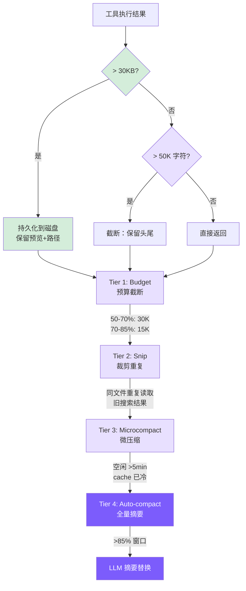

# 7. 上下文管理

## 本章目标

到上一章为止，agent 已经能安全地读写、跑命令了，可还有个绕不过去的问题——第 1 章就埋下了：消息数组每一轮都在变长。跑上几十轮，它迟早撑爆模型的上下文窗口，一旦超了，API 直接报错，整轮对话就断了。这一章造上下文压缩，让 agent 能一直跑下去。

压缩做成四层，从最轻的「裁掉大块工具输出」到最重的「让模型把整段对话总结成一段摘要」，逐级加码，能用轻的就不上重的。章末还会顺手接上前缀缓存——第 3 章切出来的那个静态核心，正好在这里省钱。



## 我们的实现

分层来做：执行时截断（Tier 0）打底兜住单次超大输出，上面叠 4 个压缩 tier——Budget、Snip、Microcompact、Auto-compact——从轻到重，前三个每次 API 调用前顺序跑，最重的 Auto-compact 在 turn 边界触发。

### 第 0 层：执行时截断（truncateResult）

<!-- tabs:start -->
#### **TypeScript**
```typescript
// tools.ts
const MAX_RESULT_CHARS = 50000;

function truncateResult(result: string): string {
  if (result.length <= MAX_RESULT_CHARS) return result;
  const keepEach = Math.floor((MAX_RESULT_CHARS - 60) / 2);
  return (
    result.slice(0, keepEach) +
    "\n\n[... truncated " + (result.length - keepEach * 2) + " chars ...]\n\n" +
    result.slice(-keepEach)
  );
}
```
#### **Python**
```python
# tools.py
MAX_RESULT_CHARS = 50000

def _truncate_result(result: str) -> str:
    if len(result) <= MAX_RESULT_CHARS:
        return result
    keep_each = (MAX_RESULT_CHARS - 60) // 2
    return (
        result[:keep_each]
        + f"\n\n[... truncated {len(result) - keep_each * 2} chars ...]\n\n"
        + result[-keep_each:]
    )
```
<!-- tabs:end -->

保留头尾而非只保留头部：文件开头有 imports、类定义等结构信息，命令输出的错误摘要通常在最后。

与 Claude Code 的区别：Claude Code 持久化到磁盘，模型后续可用 Read 工具取回完整内容。我们现在也实现了持久化——见下方 persistLargeResult。两层配合、顺序关键：工具层返回**完整**结果，agent 层先用 persistLargeResult 把 >30KB 的结果全量落盘（上下文只留预览），truncateResult 移到 persist **之后**作兜底——只对极端情况（如单行超长的预览消息）生效。注意 truncateResult 不能在工具层先执行：那样落盘的就已经是截断品，信息在持久化前就丢了（这正是 issue #6 修复的 bug）。

### 第 0.5 层：大结果持久化（persistLargeResult）

当工具返回结果超过 30KB 时，将完整内容写入磁盘，上下文中只保留预览和文件路径。模型后续可以用 `read_file` 按需取回完整输出。

```typescript
// agent.ts — persistLargeResult

private persistLargeResult(toolName: string, result: string): string {
  const THRESHOLD = 30 * 1024; // 30 KB
  if (Buffer.byteLength(result) <= THRESHOLD) return result;

  const dir = join(homedir(), ".mini-claude", "tool-results");
  mkdirSync(dir, { recursive: true });
  const filename = `${Date.now()}-${toolName}.txt`;
  const filepath = join(dir, filename);
  writeFileSync(filepath, result);

  const lines = result.split("\n");
  const preview = lines.slice(0, 200).join("\n");
  const sizeKB = (Buffer.byteLength(result) / 1024).toFixed(1);

  return `[Result too large (${sizeKB} KB, ${lines.length} lines). Full output saved to ${filepath}. You can use read_file to see the full result.]\n\nPreview (first 200 lines):\n${preview}`;
}
```

这一层的设计要点：

- **30KB 阈值低于 truncateResult 的 50K 限制**：在截断发生之前先拦截大结果，避免不可逆的信息丢失。如果一个结果有 80KB，persistLargeResult 会先将完整内容保存到磁盘，返回预览；而不是等 truncateResult 把中间部分永久丢弃。
- **200 行预览**：给模型足够的上下文来判断是否需要读取完整输出。大多数情况下，前 200 行已经包含了关键信息（文件列表的开头、搜索结果的前几个匹配、命令输出的主要内容）。
- **可恢复 vs 不可恢复**：这是与 truncateResult 的根本区别。truncateResult 是不可逆的——被截掉的内容永远消失了。persistLargeResult 把数据保存到 `~/.mini-claude/tool-results/{timestamp}-{toolName}.txt`，模型随时可以用 `read_file` 取回。
- **调用时机**：在主循环中每次工具执行完成后、结果添加到消息之前调用。这意味着它在 truncateResult 之前生效——先尝试保存，保存后返回的预览文本通常远小于 50K，不会再触发截断。
- **与 Claude Code 的对齐**：这一设计直接对应 Claude Code 的 Level 1 策略（持久化到磁盘，上下文中只保留引用）。区别在于 Claude Code 用 2KB 预览，我们用 200 行——思路相同，实现简化。

### 第 1 层：Budget — 动态缩减工具结果

随上下文压力动态收紧历史中工具结果的大小：

<!-- tabs:start -->
#### **TypeScript**
```typescript
// agent.ts
private budgetToolResultsAnthropic(): void {
  const utilization = this.lastInputTokenCount / this.effectiveWindow;
  if (utilization < 0.5) return;

  const budget = utilization > 0.7 ? 15000 : 30000;

  for (const msg of this.anthropicMessages) {
    if (msg.role !== "user" || !Array.isArray(msg.content)) continue;
    for (let i = 0; i < msg.content.length; i++) {
      const block = msg.content[i] as any;
      if (block.type === "tool_result" && typeof block.content === "string"
          && block.content.length > budget) {
        const keepEach = Math.floor((budget - 80) / 2);
        block.content = block.content.slice(0, keepEach) +
          `\n\n[... budgeted: ${block.content.length - keepEach * 2} chars truncated ...]\n\n` +
          block.content.slice(-keepEach);
      }
    }
  }
}
```
#### **Python**
```python
# agent.py
def _budget_tool_results_anthropic(self) -> None:
    utilization = self.last_input_token_count / self.effective_window if self.effective_window else 0
    if utilization < 0.5:
        return
    budget = 15000 if utilization > 0.70 else 30000
    for msg in self._anthropic_messages:
        if msg.get("role") != "user" or not isinstance(msg.get("content"), list):
            continue
        for block in msg["content"]:
            if (isinstance(block, dict) and block.get("type") == "tool_result"
                    and isinstance(block.get("content"), str) and len(block["content"]) > budget):
                keep = (budget - 80) // 2
                block["content"] = (
                    block["content"][:keep]
                    + f"\n\n[... budgeted: {len(block['content']) - keep * 2} chars truncated ...]\n\n"
                    + block["content"][-keep:]
                )
```
<!-- tabs:end -->

第 0 层是一次性的 50K 硬限制；Budget 是每次 API 调用前重算，预算随利用率自动收紧。用双阈值（50%/70%）而非单阈值，是为了在上下文还宽裕时多保留细节。

### 第 2 层：Snip — 替换过时的工具结果

<!-- tabs:start -->
#### **TypeScript**
```typescript
// agent.ts
const SNIPPABLE_TOOLS = new Set(["read_file", "grep_search", "list_files", "run_shell"]);
const SNIP_PLACEHOLDER = "[Content snipped - re-read if needed]";
const KEEP_RECENT_RESULTS = 3;
```
#### **Python**
```python
# agent.py
SNIPPABLE_TOOLS = {"read_file", "grep_search", "list_files", "run_shell"}
SNIP_PLACEHOLDER = "[Content snipped - re-read if needed]"
KEEP_RECENT_RESULTS = 3
```
<!-- tabs:end -->

Snip 策略（利用率 > 60% 时触发）：
- 同一文件被 `read_file` 多次读取 → 只保留最新一次，旧的 snip
- 同类搜索结果超过 3 个 → snip 最旧的
- 最近 3 个 `tool_result` 永远保留

关键点：**只清 `tool_result` 的 content，保留 `tool_use` block 不变**。模型仍能看到"我之前读了 /src/main.ts"，只是看不到内容了——如果需要，可以重新调用 `read_file`。保留元数据比保留数据更重要。

### 第 3 层：Microcompact — 缓存冷启动时激进清理

<!-- tabs:start -->
#### **TypeScript**
```typescript
// agent.ts
const MICROCOMPACT_IDLE_MS = 5 * 60 * 1000;

private microcompactAnthropic(): void {
  if (!this.lastApiCallTime ||
      (Date.now() - this.lastApiCallTime) < MICROCOMPACT_IDLE_MS) return;
  // 除最近 3 个外，所有旧 tool_result → "[Old result cleared]"
}
```
#### **Python**
```python
# agent.py
MICROCOMPACT_IDLE_S = 5 * 60

def _microcompact_anthropic(self) -> None:
    if not self.last_api_call_time or (time.time() - self.last_api_call_time) < MICROCOMPACT_IDLE_S:
        return
    # 除最近 3 个外，所有旧 tool_result → "[Old result cleared]"
```
<!-- tabs:end -->

用时间触发的原因：prompt cache 有 TTL，空闲超过 5 分钟后缓存大概率已过期，继续保留旧消息内容没有成本优势，不如激进清理。

Snip 是选择性的（只替换"过时"结果），Microcompact 是无差别的（除最新 3 个外全清）——更激进，但触发条件更严格。

我们只实现了基于时间的路径。Claude Code 的缓存编辑路径依赖 `cache_edits` API 机制，对教学实现过于复杂。

### 第 4 层：Auto-compact — 全量摘要压缩

#### 触发条件

<!-- tabs:start -->
#### **TypeScript**
```typescript
// agent.ts
private async checkAndCompact(): Promise<void> {
  if (this.lastInputTokenCount > this.effectiveWindow * 0.85) {
    printInfo("Context window filling up, compacting conversation...");
    await this.compactConversation();
  }
}
```
#### **Python**
```python
# agent.py
async def _check_and_compact(self) -> None:
    if self.last_input_token_count > self.effective_window * 0.85:
        print_info("Context window filling up, compacting conversation...")
        await self._compact_conversation()
```
<!-- tabs:end -->

`effectiveWindow = 模型上下文窗口 - 20000`，预留给新一轮输入/输出。对 Claude（200K 窗口），触发点约在 76.5% 总利用率。

> ⚠️ **调用方契约**：`checkAndCompact` 只能在 turn boundary 调用（用户输入 push 进消息数组之后、API 调用之前）。下面的 `compactAnthropic` / `compactOpenAI` 会把消息数组的最后一条当成"已被处理的纯文本 user 消息"——它会先 `slice(0, -1)` 去生成摘要，再在最后把这条消息 append 回来。一旦在 tool 循环中段调用，最后一条会是 `tool_result`（Anthropic）或 `tool` role（OpenAI），slice 后前面 `assistant` 的 `tool_use` / `tool_calls` 失去配对，API 会直接报错。

#### Anthropic 后端压缩

<!-- tabs:start -->
#### **TypeScript**
```typescript
// agent.ts
private async compactAnthropic(): Promise<void> {
  if (this.anthropicMessages.length < 4) return;

  const lastUserMsg = this.anthropicMessages[this.anthropicMessages.length - 1];

  const summaryResp = await this.anthropicClient!.messages.create({
    model: this.model,
    max_tokens: 2048,
    system: "You are a conversation summarizer. Be concise but preserve important details.",
    messages: [
      ...this.anthropicMessages.slice(0, -1),
      {
        role: "user",
        content: "Summarize the conversation so far in a concise paragraph, "
               + "preserving key decisions, file paths, and context needed to continue the work.",
      },
    ],
  });

  const summaryText = summaryResp.content[0]?.type === "text"
    ? summaryResp.content[0].text
    : "No summary available.";

  this.anthropicMessages = [
    {
      role: "user",
      content: `[Previous conversation summary]\n${summaryText}`,
    },
    {
      role: "assistant",
      content: "Understood. I have the context from our previous conversation. "
             + "How can I continue helping?",
    },
  ];

  if (lastUserMsg.role === "user") {
    this.anthropicMessages.push(lastUserMsg);
  }

  this.lastInputTokenCount = 0;
}
```
#### **Python**
```python
# agent.py
async def _compact_anthropic(self) -> None:
    if len(self._anthropic_messages) < 4:
        return

    last_user_msg = self._anthropic_messages[-1]

    summary_resp = await self._anthropic_client.messages.create(
        model=self.model,
        max_tokens=2048,
        system="You are a conversation summarizer. Be concise but preserve important details.",
        messages=[
            *self._anthropic_messages[:-1],
            {"role": "user", "content": "Summarize the conversation so far in a concise paragraph, "
             "preserving key decisions, file paths, and context needed to continue the work."},
        ],
    )
    summary_text = (summary_resp.content[0].text
                    if summary_resp.content and summary_resp.content[0].type == "text"
                    else "No summary available.")

    self._anthropic_messages = [
        {"role": "user", "content": f"[Previous conversation summary]\n{summary_text}"},
        {"role": "assistant", "content": "Understood. I have the context from our previous conversation. How can I continue helping?"},
    ]

    if last_user_msg.get("role") == "user":
        self._anthropic_messages.append(last_user_msg)
    self.last_input_token_count = 0
```
<!-- tabs:end -->

与 Claude Code 的主要差异：Claude Code 用"分析-摘要"两阶段提示词生成更高质量的摘要，压缩后恢复最近 5 个文件和活跃技能，有熔断器防无限循环。我们是简化版——单段摘要、无恢复机制、无熔断。

#### OpenAI 后端压缩

OpenAI 的 system prompt 在消息数组中（`role: "system"`），压缩时需要额外保留：

<!-- tabs:start -->
#### **TypeScript**
```typescript
// agent.ts
private async compactOpenAI(): Promise<void> {
  if (this.openaiMessages.length < 5) return;

  const systemMsg = this.openaiMessages[0];
  const lastUserMsg = this.openaiMessages[this.openaiMessages.length - 1];

  const summaryResp = await this.openaiClient!.chat.completions.create({
    model: this.model,
    max_tokens: 2048,
    messages: [
      { role: "system", content: "You are a conversation summarizer. Be concise but preserve important details." },
      ...this.openaiMessages.slice(1, -1),
      { role: "user", content: "Summarize the conversation so far..." },
    ],
  });

  const summaryText = summaryResp.choices[0]?.message?.content || "No summary available.";

  this.openaiMessages = [
    systemMsg,
    { role: "user", content: `[Previous conversation summary]\n${summaryText}` },
    { role: "assistant", content: "Understood. I have the context..." },
  ];

  if ((lastUserMsg as any).role === "user") {
    this.openaiMessages.push(lastUserMsg);
  }

  this.lastInputTokenCount = 0;
}
```
#### **Python**
```python
# agent.py
async def _compact_openai(self) -> None:
    if len(self._openai_messages) < 5:
        return

    system_msg = self._openai_messages[0]
    last_user_msg = self._openai_messages[-1]

    summary_resp = await self._openai_client.chat.completions.create(
        model=self.model,
        max_tokens=2048,
        messages=[
            {"role": "system", "content": "You are a conversation summarizer. Be concise but preserve important details."},
            *self._openai_messages[1:-1],
            {"role": "user", "content": "Summarize the conversation so far..."},
        ],
    )
    summary_text = summary_resp.choices[0].message.content or "No summary available."

    self._openai_messages = [
        system_msg,
        {"role": "user", "content": f"[Previous conversation summary]\n{summary_text}"},
        {"role": "assistant", "content": "Understood. I have the context..."},
    ]

    if last_user_msg.get("role") == "user":
        self._openai_messages.append(last_user_msg)
    self.last_input_token_count = 0
```
<!-- tabs:end -->

守卫条件是 `< 5` 而非 `< 4`，因为 OpenAI 消息数组最少包含 system + 2 轮对话 + 最新用户消息 = 5 条。

### 手动压缩

```
> /compact
  ℹ Conversation compacted.
```

调用链：`cli.ts` → `agent.compact()` → `compactConversation()` → `compactAnthropic()` / `compactOpenAI()`

### Token 统计与管道编排

每次 API 调用后更新：

<!-- tabs:start -->
#### **TypeScript**
```typescript
const cacheRead = (response.usage as any).cache_read_input_tokens || 0;
const cacheCreation = (response.usage as any).cache_creation_input_tokens || 0;
this.totalInputTokens += response.usage.input_tokens;   // 只是未缓存部分
this.totalCacheReadTokens += cacheRead;
this.totalCacheCreationTokens += cacheCreation;
this.totalOutputTokens += response.usage.output_tokens;
this.lastInputTokenCount =
  response.usage.input_tokens + cacheRead + cacheCreation + response.usage.output_tokens;
```
#### **Python**
```python
cache_read = getattr(response.usage, "cache_read_input_tokens", 0) or 0
cache_creation = getattr(response.usage, "cache_creation_input_tokens", 0) or 0
self.total_input_tokens += response.usage.input_tokens   # 只是未缓存部分
self.total_cache_read_tokens += cache_read
self.total_cache_creation_tokens += cache_creation
self.total_output_tokens += response.usage.output_tokens
self.last_input_token_count = (
    response.usage.input_tokens + cache_read + cache_creation + response.usage.output_tokens
)
```
<!-- tabs:end -->

开了缓存后 `input_tokens` 只剩未命中的那点，所以 `lastInputTokenCount`（用来判断是否接近窗口上限）得把三类输入 token 加回来，再带上本轮 output——它下一轮会变成 prompt 的一部分。`totalInputTokens` 与 cache read/write 分开累计，费用估算见「前缀缓存」一节。

4 层在每次 API 调用前顺序执行：

<!-- tabs:start -->
#### **TypeScript**
```typescript
private runCompressionPipeline(): void {
  this.budgetToolResultsAnthropic();   // Tier 1
  this.snipStaleResultsAnthropic();    // Tier 2
  this.microcompactAnthropic();         // Tier 3
}
```
#### **Python**
```python
def _run_compression_pipeline(self) -> None:
    if self.use_openai:
        self._budget_tool_results_openai()
        self._snip_stale_results_openai()
        self._microcompact_openai()
    else:
        self._budget_tool_results_anthropic()
        self._snip_stale_results_anthropic()
        self._microcompact_anthropic()
```
<!-- tabs:end -->

Tier 1-3 在每次 API 调用**前**运行（零 API 成本），Tier 4 在 **turn boundary 触发**——即每次用户输入 push 进消息数组后、`while` 主循环开始前。**不要**把 Tier 4 放在 tool 循环末尾：那时最后一条消息是 `{role: "user", content: [tool_result, ...]}`，`compactAnthropic` 内部的 `slice(0, -1)` 会切断它与前一条 `assistant` 消息里 `tool_use` 的配对，Anthropic API 会以 *"tool_use ids were found without tool_result blocks immediately after"* 拒绝那次 summarize 请求。`lastInputTokenCount` 在新位置仍然有效——它反映上一轮最后一次 API call 的状态，足以判断是否触发。顺序也有意义：Budget 先压缩大结果，让 Snip 的去重判断更准确，Microcompact 最后在时间条件满足时无差别清理。

## 前缀缓存

前面几层管的是"上下文太大怎么缩"，这一节管的是另一件事：同样一段前缀，怎么让服务端别每轮都重新算一遍。早期版本没做缓存，每轮都把完整的系统提示词、工具定义和不断增长的历史当全新输入发出去、全价计费——一次请求光前缀就有五千多个 token 被反复重算。补上缓存后，多轮对话里第二轮起这部分基本免费。

Claude Code 的完整做法在[第 3 章](https://windy3f3f3f3f.github.io/how-claude-code-works/#/docs/03-context-engineering)讲得很细，这里说我们照着搬了哪些、哪些搬不动。

### 两个缓存断点

Anthropic 的缓存不会凭空发生——请求里没有任何 `cache_control`，就一点都不缓存、全价计费。开启方式有两种：像 Claude Code 一样显式打块级断点，或用 2026 年初上线的顶层 automatic caching（请求顶层放一个 `cache_control` 字段，系统自动放置并推进断点）。我们照 Claude Code 的做法走显式断点，打两个：

第一个在系统提示词上。`buildAnthropicSystem` 把 `system` 从一个字符串拆成两个 text block——静态核心（所有会话都一样的角色、规则、工具说明）标 `cache_control`，动态尾巴（环境、git、技能列表）跟在后面不标。工具数组不用单独打断点：API 的渲染顺序是 `tools → system → messages`，标在静态 system 块上，前面的工具定义就一并缓存了。

第二个断点滚动地打在最后一条消息上。`withCacheBreakpoints` 每次请求前给消息数组末条的最后一个内容块标 `cache_control`，这样上一轮及更早的消息全部落在缓存前缀里，只有本轮新增的部分需要重新处理。它是个纯函数，返回一份改过的副本、不动原始历史——否则 `cache_control` 这种请求元数据会被写进会话存档和摘要请求。跳过 `thinking` 块是因为它们内容不稳定，标在上面反而降低命中率。

<!-- tabs:start -->
#### **TypeScript**
```typescript
private buildAnthropicSystem(): Anthropic.TextBlockParam[] {
  const blocks: Anthropic.TextBlockParam[] = [
    { type: "text", text: this.staticSystemPrompt, cache_control: { type: "ephemeral" } },
  ];
  if (dynamicText) blocks.push({ type: "text", text: dynamicText });
  return blocks;
}
```
#### **Python**
```python
def _build_anthropic_system(self) -> list[dict]:
    blocks = [{"type": "text", "text": self._static_system_prompt,
               "cache_control": {"type": "ephemeral"}}]
    if dynamic_text:
        blocks.append({"type": "text", "text": dynamic_text})
    return blocks
```
<!-- tabs:end -->

CLAUDE.md 和日期没放进系统提示词，而是包成 `<system-reminder>` 塞进第一条 user 消息（Claude Code 的 `prependUserContext`）。这些内容因项目而异，留在系统提示词里会让缓存的静态块变得每个项目一份，白占缓存。

### 两处只能近似

Claude Code 有两样东西是 Anthropic 第一方的内部能力，公开 API 给不了，我们只能近似，并在这里讲清楚：

一是 `scope: 'global'` 跨用户共享。Claude Code 的静态系统提示词全球用户共享同一份缓存。公开 API 没有这个参数——省略它就落回公开 API 的默认隔离范围（按当前官方文档是 workspace / 组织一级），而这恰好和 Claude Code 装了 MCP、无法全局共享时走的那条 fallback 路径字节一致，所以谈不上偏离，只是共享范围小一圈。

二是 `cache_edits` 热缓存就地删除。第 3 章讲过 microcompact 有冷、热两条路径：缓存冷时直接改消息，缓存热时用 `cache_edits` 让服务端在缓存里删旧结果、不动本地消息。热路径靠的是内部 API——连泄露的源码里这段都被剥掉了。我们没有这条路，于是退一步：缓存热的时候干脆不改历史。反正命中的前缀按 0.1× 计费，重发旧结果本来就便宜，不删也不亏多少。

### 缓存和压缩会打架

这一步是上面第 2 层 Snip 里那个"缓存热度门"的由来。Snip 会原地改写旧的工具结果，可只要动了已经缓存的前缀，从那条消息往后的缓存全部作废。所以 Snip 现在先看缓存热不热：还热、而且利用率不高（低于 75%）时就不动它，等缓存自己过期再清；一旦利用率顶到 75% 以上，宁可破一次缓存也得把窗口腾出来，免得撑到更贵的 auto-compact。换句话说，激进裁剪和前缀缓存本是一对矛盾——真开了缓存，反而不需要裁得那么狠。

### 花销怎么算

命中缓存的 token 不按全价算：读缓存是 0.1×、写缓存是 1.25×，和 Claude Code 的 `modelCost.ts` 定倍率一致。`getCurrentCostUsd` 把这三类 token 分开计价，`/cost` 顺带报一个命中率。OpenAI 兼容后端不用标 `cache_control`——provider 自动缓存前缀，命中的部分在 `prompt_tokens_details.cached_tokens` 里，我们把它从 `prompt_tokens` 拆出来单算。计价上统一按 Anthropic 的 0.1× 近似；实际倍率因 provider 而异（OpenAI 官方约 0.5×，兼容网关不保证），这条路的估算可能偏高也可能偏低。

真机验证过一遍：连着两轮各发一句话，第一轮 `cache_creation` 五千多、`cache_read` 为零（冷启动、写缓存），第二轮 `cache_read` 补上、几乎等于第一轮写进去的量（命中了）。TS 和 Python 两版数字基本一致。

## 真实 Claude Code 比这多做了什么

我们的压缩就四层，撑爆前挨个试过去。真实 Claude Code 在这上面做得更细：怎么攒上下文、什么时候压、压哪一段、压完怎么不丢关键信息——每一步都有讲究。

### 上下文构建

每次 API 调用前，Claude Code 把三类信息组装进请求：

**系统提示词**是最稳定的部分，由归属头、工具 schema、安全规则等拼接而成。其中有一个 `SYSTEM_PROMPT_DYNAMIC_BOUNDARY` 哨兵将其分为静态半区和动态半区——静态半区对所有用户完全相同，标记 `scope: 'global'` 全球共享缓存；动态半区（MCP 工具、语言偏好等）因用户而异，不共享。这让全球数百万用户共享同一份核心系统提示词的缓存，是主要的成本优化手段之一。

**系统/用户上下文**每会话计算一次并 memoize：git 状态（5 个命令并行执行）、CLAUDE.md 文件（从 CWD 向上遍历目录树）、当前日期等。注入顺序是刻意安排的——系统上下文后置于系统提示词，用户上下文前置于消息数组，确保最稳定的内容在最前面，最大化缓存命中。

**消息历史**记录对话中的一切，是压缩管道的主要操作对象。发送给 API 前会经过 `normalizeMessagesForAPI()` 修复格式问题：附件重排序、处理 thinking 块、合并分裂消息、验证 `tool_use`/`tool_result` 配对等。

### 5 级压缩流水线

设计哲学是**渐进式压缩**：先用成本最低的手段，只在必要时才动更重的武器。

**Level 1: Tool Result 预算裁剪** — 工具声明 `maxResultSizeChars`（默认 50K 字符），超限时**持久化到磁盘**，上下文中只保留紧凑引用和 2KB 预览。选择持久化而非截断的原因：数据没有丢失，模型可以随时用 Read 工具读取完整文件。

**Level 2: History Snip** — Feature-gated 功能，裁剪历史中的冗余部分。释放的量会传递给后续 autocompact 的阈值计算，因为 snip 移除消息后最后一条 assistant 消息的 `usage` 仍反映 snip 前的大小，不修正会导致 autocompact 过早触发。

**Level 3: Microcompact** — 清理不再需要的旧工具结果，有两条路径：
- **缓存已冷**（空闲超过 N 分钟）：直接修改消息内容，将旧工具结果替换为占位符。缓存过期了，修改不会造成额外失效。
- **缓存仍热**：使用 API 级的 `cache_edits` 机制在服务端就地删除，完全不修改本地消息，避免缓存前缀失效。

**Level 4: Context Collapse** — 投影式折叠，关键特性是**不修改原始消息**，只创建一个折叠视图。类比数据库 View：底层表不变，查询时看到过滤后的结果。启用时会抑制 Autocompact，避免两者竞争。

**Level 5: Autocompact** — 最后手段，fork 子 Agent 调用 API 生成摘要。触发阈值约 85.5% 上下文利用率。压缩提示词用"分析-摘要"两阶段：先让模型在 `<analysis>` 块推理，再生成标准化的 `<summary>`（9 个部分），最后剥离推理过程只保留摘要——典型的链式思考草稿技术。

### Token 预算与缓存

**Token 估算**从不调用额外 API：用最近一次 API 返回的 `usage` 作为锚点，新增消息用字符数 / 4 粗估。误差从纯估算的 30%+ 降到 <5%。

**Prompt 缓存**脆弱性在于前缀中任何字节变化都会导致失效。Claude Code 在多个层面维护稳定性：静态/动态边界标记、beta header 粘性锁存（一旦发送就持续出现，不随 feature flag 变化）、system 静态块与最后一条消息两处缓存断点（工具数组渲染在 system 之前，随其断点一并缓存）、以及断裂检测（`cache_read_input_tokens` 下降 >5% 时自动归因）。

**熔断器**：曾有会话连续 autocompact 失败 3,272 次，浪费大量 API 调用。现在连续 3 次失败后直接停止重试。

## 简化对比

| 维度 | Claude Code | mini-claude |
|------|------------|-------------|
| **压缩层级** | 5 级流水线 | 4 层（budget + snip + microcompact + 摘要） |
| **Token 计数** | 锚点+粗估，不额外调 API | 直接用 API 返回值，cache read/write 分开计价 |
| **Budget 触发** | 基于剩余预算 | 50%/70% 双阈值 |
| **Snip 策略** | 选择性裁剪 + cache 感知 | 同文件去重 + 保留最近 3 个 + 缓存热度门 |
| **Microcompact** | 时间路径 + 缓存编辑路径 | 只有 5 分钟空闲触发 |
| **前缀缓存** | 2 显式断点（tools 随 system 覆盖）+ scope:global + 断裂检测 | 2 断点（system + 末条消息），scope 走默认（workspace 级） |
| **Auto-compact** | 两阶段摘要 + 压缩后恢复 + 熔断器 | 单段摘要，无恢复 |
| **溢出存储** | 磁盘持久化，可按需读取 | 磁盘持久化（>30KB），可按需读取 |
---

> **下一章**：让 Agent 跨会话记住信息——记忆系统。
