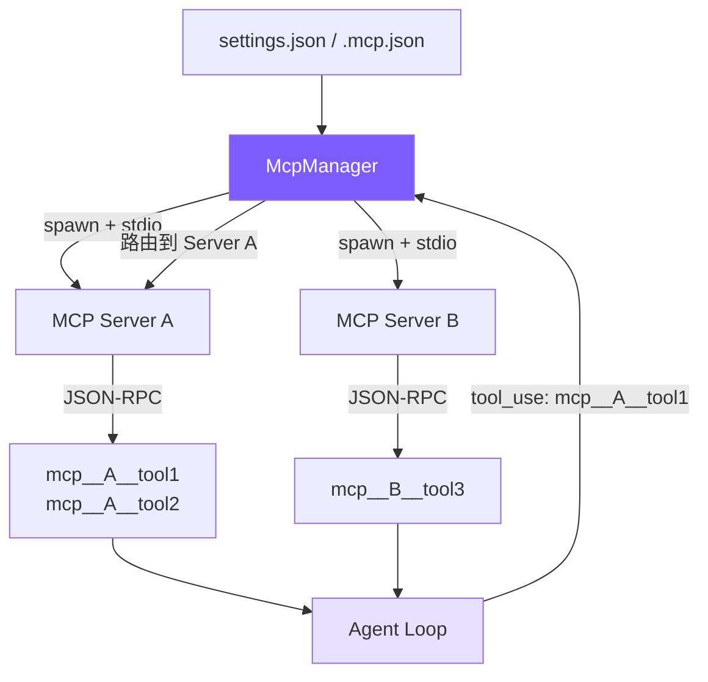

# 12. MCP 集成

## 本章目标

到现在，agent 的工具全写死在 `tools.ts` 里——想加个新工具就得改源码。这一章接上 MCP，一个让 agent 动态挂载外部工具的协议。

在配置里声明一个服务器地址，就能把数据库、Slack、GitHub 这些服务的工具接进来，不动一行 agent 代码。我们做一个最小的 MCP 客户端：通过 JSON-RPC over stdio 跟服务器握手、问它有哪些工具、把模型的调用转发过去、再把结果拿回来。



> ▶ **跑这一章**：`node steps/run.mjs 12`（无需 API key）——看模型调一个来自外部 MCP 服务器的 `add` 工具。加 `--diff` 看它比上一章多了什么。想拿自己的 prompt 连真实模型，就加 `--live`（读 `.env` 里的 key，`--py` 跑 Python 版）。

核心思路：**spawn 子进程 → JSON-RPC 握手 → 发现工具 → 前缀注册 → 透明路由**。对 Agent Loop 来说，MCP 工具和内置工具没有区别——都是名字 + schema + 执行函数。

## 配置格式

用户只需在配置文件中声明 MCP 服务器，Agent 会在首次 chat 时自动连接并注册它们的工具：

```json
// ~/.claude/settings.json（用户级）或 .claude/settings.json（项目级）
{
  "mcpServers": {
    "filesystem": {
      "command": "npx",
      "args": ["@modelcontextprotocol/server-filesystem", "/tmp"],
      "env": {}
    },
    "github": {
      "command": "npx",
      "args": ["@modelcontextprotocol/server-github"],
      "env": {
        "GITHUB_TOKEN": "ghp_xxx"
      }
    }
  }
}
```

也可以使用项目根目录的 `.mcp.json`，格式相同。三处配置的服务器合并后一起连接，同名服务器后读覆盖先读。

## 我们的实现

到现在，agent 的工具全写死在 `tools.ts` 里——想加个新工具就得改源码。这一章接上 MCP：一个让 agent 动态挂载外部工具的协议。声明一个服务器，就能把它的工具接进来，不动一行 agent 逻辑。相对上一章，新增了一个 `mcp.ts`，agent 启动时连上服务器、把发现的工具（带 `mcp__` 前缀）并进工具表，调用时再路由回去：

<!-- tabs:start -->
#### **TypeScript**
<!-- @diff file=agent.ts step=12 lang=ts -->
```diff
@@ -6,4 +6,5 @@ import { maybeCompact } from "./context.js";
 import { recallMemories } from "./memory.js";
 import { runSubAgent } from "./subagent.js";
+import { connectMcp, type McpConnection } from "./mcp.js";
 
 const MODEL = process.env.MINI_MODEL || "claude-sonnet-4-5-20250929";
@@ -29,4 +30,5 @@ export class Agent {
   async chat(userText: string): Promise<void> {
     this.messages.push({ role: "user", content: userText });
+    await this.ensureMcp(); // discover external MCP tools before the loop
 
     while (true) {
@@ -36,4 +38,7 @@ export class Agent {
       // Recall memories relevant to what the user just asked, into the prompt.
       system += recallMemories(userText);
+      // Merge in any external MCP tools, prefixed so we can route their calls back.
+      const mcpTools: Anthropic.Tool[] = (this.mcp?.tools || []).map((t) => ({ name: `mcp__demo__${t.name}`, description: t.description, input_schema: t.input_schema as any }));
+      const tools = [...toolDefinitions, ...mcpTools];
       // Build the request once. Passing `tools` is the one line that makes the
       // model tool-aware. Chapter 5 turns the call itself into a stream.
@@ -42,5 +47,5 @@ export class Agent {
         max_tokens: 4096,
         system,
-        tools: toolDefinitions,
+        tools,
         messages: this.messages,
       };
@@ -72,4 +77,13 @@ export class Agent {
           continue;
         }
+        // MCP tools (mcp__server__tool) are routed to the MCP server, not run locally.
+        if (tu.name.startsWith("mcp__")) {
+          // mcp__<server>__<tool> → <tool>; drop the first two "__" segments so a
+          // server name with underscores strips the same way Python's does.
+          const toolName = tu.name.split("__").slice(2).join("__");
+          const output = this.mcp ? await this.mcp.callTool(toolName, tu.input) : "Denied: no MCP server connected.";
+          results.push({ type: "tool_result", tool_use_id: tu.id, content: output });
+          continue;
+        }
         // Plan mode is read-only: writes and shell are denied on top of the gate.
         const blocked = checkPermission(tu.name, tu.input as Record<string, any>) === "deny"
@@ -89,3 +103,9 @@ export class Agent {
   clearHistory(): void { this.messages = []; }
   setMode(m: string): void { this.mode = m; }
+  private mcp: McpConnection | null = null;
+  // Connect to the MCP server named in MINI_MCP_SERVER once, on first use.
+  private async ensureMcp(): Promise<void> {
+    if (this.mcp || !process.env.MINI_MCP_SERVER) return;
+    this.mcp = await connectMcp("node", [process.env.MINI_MCP_SERVER]);
+  }
 }
```
<!-- @enddiff -->
#### **Python**
<!-- @diff file=agent.py step=12 lang=py -->
```diff
@@ -10,4 +10,5 @@ from context import maybe_compact
 from memory import recall_memories
 from subagent import run_sub_agent
+from mcp_client import connect_mcp
 
 MODEL = os.environ.get("MINI_MODEL", "claude-sonnet-4-5-20250929")
@@ -27,4 +28,5 @@ class Agent:
         self.messages: list = []
         self.mode = "default"  # "plan" makes the agent read-only
+        self.mcp = None
 
     # One user turn. Call the model; if it asks for tools, run them and feed the
@@ -33,4 +35,5 @@ class Agent:
     def chat(self, user_text: str) -> None:
         self.messages.append({"role": "user", "content": user_text})
+        self._ensure_mcp()  # discover external MCP tools before the loop
 
         while True:
@@ -40,5 +43,8 @@ class Agent:
             # Recall memories relevant to what the user just asked, into the prompt.
             system += recall_memories(user_text)
-            tools = tool_definitions
+            # Merge in any external MCP tools, prefixed so we can route their calls back.
+            mcp_tools = [{"name": f"mcp__demo__{t['name']}", "description": t["description"], "input_schema": t["input_schema"]}
+                         for t in (self.mcp.tools if self.mcp else [])]
+            tools = tool_definitions + mcp_tools
             kwargs = dict(model=MODEL, max_tokens=4096, system=system, tools=tools, messages=self.messages)
 
@@ -68,4 +74,12 @@ class Agent:
                     results.append({"type": "tool_result", "tool_use_id": tu.id, "content": summary})
                     continue
+                # MCP tools (mcp__server__tool) go to the MCP server, not run locally.
+                if tu.name.startswith("mcp__"):
+                    # mcp__<server>__<tool> -> <tool>; drop the first two "__"
+                    # segments so it strips the same way the TypeScript side does.
+                    tool_name = "__".join(tu.name.split("__")[2:])
+                    output = self.mcp.call_tool(tool_name, tu.input) if self.mcp else "Denied: no MCP server connected."
+                    results.append({"type": "tool_result", "tool_use_id": tu.id, "content": output})
+                    continue
                 # Plan mode is read-only: writes and shell are denied on top of the gate.
                 blocked = check_permission(tu.name, tu.input) == "deny" or (
@@ -87,2 +101,6 @@ class Agent:
     def set_mode(self, m: str) -> None:
         self.mode = m
+    # Connect to the MCP server named in MINI_MCP_SERVER once, on first use.
+    def _ensure_mcp(self):
+        if self.mcp is None and os.environ.get("MINI_MCP_SERVER"):
+            self.mcp = connect_mcp("node", [os.environ["MINI_MCP_SERVER"]])
```
<!-- @enddiff -->
<!-- tabs:end -->

MCP 客户端就是「spawn 服务器子进程，用 stdio 上的 JSON-RPC 握手、发现工具、调用工具」——这正是 MCP 的精髓（真实 MCP 还有多种传输和鉴权，这里只留 stdio）：

<!-- tabs:start -->
#### **TypeScript**
<!-- @snippet lang=ts file=mcp.ts region=mcp step=12 -->
```typescript
export async function connectMcp(command: string, args: string[]): Promise<McpConnection> {
  const proc = spawn(command, args, { stdio: ["pipe", "pipe", "inherit"] });
  const rl = createInterface({ input: proc.stdout! });
  let nextId = 1;
  const pending = new Map<number, (v: any) => void>();
  rl.on("line", (line) => {
    try { const msg = JSON.parse(line); if (msg.id && pending.has(msg.id)) { pending.get(msg.id)!(msg); pending.delete(msg.id); } } catch {}
  });
  const request = (method: string, params?: unknown) =>
    new Promise<any>((resolve) => {
      const id = nextId++;
      pending.set(id, resolve);
      proc.stdin!.write(JSON.stringify({ jsonrpc: "2.0", id, method, params }) + "\n");
    });

  await request("initialize", { protocolVersion: "2024-11-05", capabilities: {}, clientInfo: { name: "mini-claude", version: "1.0" } });
  proc.stdin!.write(JSON.stringify({ jsonrpc: "2.0", method: "notifications/initialized" }) + "\n");
  const listed = await request("tools/list");
  const tools: McpTool[] = (listed.result?.tools || []).map((t: any) => ({ name: t.name, description: t.description || "", input_schema: t.inputSchema }));

  return {
    tools,
    async callTool(name, args) {
      const r = await request("tools/call", { name, arguments: args });
      const content = r.result?.content || [];
      return content.filter((c: any) => c.type === "text").map((c: any) => c.text).join("") || JSON.stringify(r.result ?? r.error);
    },
    close() { proc.kill(); },
  };
}
```
<!-- @endsnippet -->
#### **Python**
<!-- @snippet lang=py file=mcp_client.py region=mcp step=12 -->
```python
class McpConnection:
    def __init__(self, command, args):
        self.proc = subprocess.Popen([command, *args], stdin=subprocess.PIPE,
                                     stdout=subprocess.PIPE, text=True, bufsize=1)
        self._id = 0
        self._lock = threading.Lock()

    def _request(self, method, params=None):
        with self._lock:
            self._id += 1
            rid = self._id
            self.proc.stdin.write(json.dumps({"jsonrpc": "2.0", "id": rid, "method": method, "params": params or {}}) + "\n")
            self.proc.stdin.flush()
            while True:
                line = self.proc.stdout.readline()
                if not line:
                    return {}
                msg = json.loads(line)
                if msg.get("id") == rid:
                    return msg

    def _notify(self, method):
        self.proc.stdin.write(json.dumps({"jsonrpc": "2.0", "method": method}) + "\n")
        self.proc.stdin.flush()

    def connect(self):
        self._request("initialize", {"protocolVersion": "2024-11-05", "capabilities": {}, "clientInfo": {"name": "mini-claude", "version": "1.0"}})
        self._notify("notifications/initialized")
        listed = self._request("tools/list")
        self.tools = [{"name": t["name"], "description": t.get("description", ""), "input_schema": t.get("inputSchema")}
                      for t in listed.get("result", {}).get("tools", [])]
        return self

    def call_tool(self, name, args):
        r = self._request("tools/call", {"name": name, "arguments": args})
        content = r.get("result", {}).get("content", [])
        text = "".join(c.get("text", "") for c in content if c.get("type") == "text")
        return text or json.dumps(r.get("result") or r.get("error"))

    def close(self):
        self.proc.terminate()


def connect_mcp(command, args):
    return McpConnection(command, args).connect()
```
<!-- @endsnippet -->
<!-- tabs:end -->

跑一下，接上一个提供 `add` 工具的示例 MCP 服务器，模型调 `mcp__demo__add(17, 25)`，服务器算出 42：

<!-- @transcript step=12 lang=ts -->
```
$ node steps/run.mjs 12
▶ step 12 demo (no API key — local mock model)   sandbox: <sandbox>
  you: Use the add tool to compute 17 + 25.


  → mcp__demo__add({"a":17,"b":25})
17 + 25 = 42.
```
<!-- @endtranscript -->

> 到这里，本章能跑的那段最小实现就讲完了——上面这些就是 `node steps/run.mjs` 这一章实际执行的**全部**代码。下面是仓库里 production 版 mini-claude 对同一件事的完整做法：边界情况、工程细节更多，当**选读扩展**看，跟这一章跑起来的那段不是同一份代码。

本章 runnable step 的 `mcp.ts` 只有 **~43 行**，演示 stdio JSON-RPC 最短的那条路。仓库里 production 版 `src/mcp.ts` 约 **277 行**，补了配置加载、多服务器、超时和错误处理——但它仍不是完整的 MCP 实现，不含 SSE 传输、OAuth 和动态刷新。两版都不依赖任何 MCP SDK，读者能直接看到协议本身。

| Claude Code | 我们的实现 | 简化原因 |
|-------------|-----------|---------|
| `@anthropic-ai/sdk` MCP 客户端 | 原始 JSON-RPC（~100 行） | 无 SDK 依赖，读者能看到协议细节 |
| stdio + SSE 两种传输 | 仅 stdio | stdio 覆盖 95% 场景 |
| 动态工具刷新 | 一次性发现 | 教程场景不需要热更新 |
| 企业策略 + 3 种配置源 | settings.json + .mcp.json | 去掉企业级配置 |
| 重试 + 降级 | 静默跳过失败服务器 | 简化错误处理 |

## 关键代码

### 1. MCP 连接 — `McpConnection` 类

每个 MCP 服务器对应一个 `McpConnection` 实例，负责子进程管理和 JSON-RPC 通信。

```typescript
class McpConnection {
  private process: ChildProcess | null = null;
  private nextId = 1;
  private pending = new Map<number, { resolve: (v: any) => void; reject: (e: Error) => void }>();
  private rl: Interface | null = null;

  constructor(private serverName: string, private config: McpServerConfig) {}
```

三个关键状态：`process` 是子进程句柄，`pending` 是请求-响应关联表（id → Promise），`rl` 是 readline 实例用于按行解析 JSON-RPC。

#### 连接与消息解析

```typescript
  async connect(): Promise<void> {
    const env = { ...process.env, ...(this.config.env || {}) };
    this.process = spawn(this.config.command, this.config.args || [], {
      stdio: ["pipe", "pipe", "pipe"],
      env,
    });

    // 按行解析 stdout 中的 JSON-RPC 消息
    this.rl = createInterface({ input: this.process.stdout! });
    this.rl.on("line", (line: string) => {
      try {
        const msg = JSON.parse(line);
        if (msg.id !== undefined && this.pending.has(msg.id)) {
          const { resolve, reject } = this.pending.get(msg.id)!;
          this.pending.delete(msg.id);
          if (msg.error) {
            reject(new Error(`MCP error ${msg.error.code}: ${msg.error.message}`));
          } else {
            resolve(msg.result);
          }
        }
      } catch {
        // 忽略非 JSON 行（服务器日志等）
      }
    });
  }
```

stdio 模式的核心：子进程的 stdin/stdout 作为双向通信通道，每行一个 JSON-RPC 消息。`pending` Map 用自增 id 关联请求和响应——发送时存入 Promise，收到响应时 resolve 或 reject。

#### 请求与通知

JSON-RPC 有两种消息：**请求**（有 id，期望响应）和**通知**（无 id，发后不管）。

```typescript
  /** 发送请求，等待响应 */
  private sendRequest(method: string, params: any = {}): Promise<any> {
    return new Promise((resolve, reject) => {
      if (!this.process?.stdin?.writable) {
        return reject(new Error(`MCP server '${this.serverName}' is not connected`));
      }
      const id = this.nextId++;
      this.pending.set(id, { resolve, reject });
      const msg = JSON.stringify({ jsonrpc: "2.0", id, method, params }) + "\n";
      this.process.stdin.write(msg);
    });
  }

  /** 发送通知，不等响应 */
  private sendNotification(method: string, params: any = {}): void {
    if (!this.process?.stdin?.writable) return;
    const msg = JSON.stringify({ jsonrpc: "2.0", method, params }) + "\n";
    this.process.stdin.write(msg);
  }
```

区别只在有无 `id` 字段。有 `id` 的消息写入 `pending` 等待配对；无 `id` 的直接写入 stdin 就结束。

#### 握手、发现、调用

```typescript
  /** MCP 初始化握手 */
  async initialize(): Promise<void> {
    await this.sendRequest("initialize", {
      protocolVersion: "2024-11-05",
      capabilities: {},
      clientInfo: { name: "mini-claude", version: "1.0.0" },
    });
    // 握手成功后发通知确认
    this.sendNotification("notifications/initialized");
  }

  /** 发现服务器提供的工具 */
  async listTools(): Promise<McpToolInfo[]> {
    const result = await this.sendRequest("tools/list");
    if (!result?.tools || !Array.isArray(result.tools)) return [];
    return result.tools.map((t: any) => ({
      name: t.name,
      description: t.description || "",
      inputSchema: t.inputSchema,
      serverName: this.serverName,
    }));
  }

  /** 调用工具，返回文本结果 */
  async callTool(name: string, args: any): Promise<string> {
    const result = await this.sendRequest("tools/call", { name, arguments: args });
    if (result?.content && Array.isArray(result.content)) {
      return result.content
        .filter((c: any) => c.type === "text")
        .map((c: any) => c.text)
        .join("\n");
    }
    return JSON.stringify(result);
  }
```

三步标准流程：`initialize`（版本协商）→ `listTools`（工具发现）→ `callTool`（执行调用）。MCP 协议要求 `initialize` 之后必须发 `notifications/initialized` 通知，告诉服务器客户端准备就绪。

`callTool` 的返回值处理值得注意：MCP 返回 `{ content: [{ type: "text", text: "..." }] }` 格式，我们只提取 `text` 类型的内容拼接返回——图片等其他类型暂不处理。

### 2. MCP 管理器 — `McpManager` 类

管理所有 MCP 连接的生命周期，对外提供统一接口。

#### 配置加载

```typescript
export class McpManager {
  private connections = new Map<string, McpConnection>();
  private tools: McpToolInfo[] = [];
  private connected = false;

  private loadConfigs(): Record<string, McpServerConfig> {
    const merged: Record<string, McpServerConfig> = {};

    // 1. 用户级：~/.claude/settings.json
    const globalPath = join(homedir(), ".claude", "settings.json");
    this.mergeConfigFile(globalPath, merged);

    // 2. 项目级：.claude/settings.json
    const projectPath = join(process.cwd(), ".claude", "settings.json");
    this.mergeConfigFile(projectPath, merged);

    // 3. MCP 专用：.mcp.json
    const mcpJsonPath = join(process.cwd(), ".mcp.json");
    this.mergeConfigFile(mcpJsonPath, merged);

    return merged;
  }

  private mergeConfigFile(filePath: string, target: Record<string, McpServerConfig>): void {
    if (!existsSync(filePath)) return;
    try {
      const raw = JSON.parse(readFileSync(filePath, "utf-8"));
      const servers = raw.mcpServers || raw;  // .mcp.json 可能直接是服务器映射
      for (const [name, config] of Object.entries(servers)) {
        if (this.isValidConfig(config)) {
          target[name] = config as McpServerConfig;
        }
      }
    } catch {
      // 静默跳过格式错误的配置文件
    }
  }
```

三处配置依次读取、合并，同名服务器后读覆盖先读。`raw.mcpServers || raw` 这行兼容两种格式：`settings.json` 的 `mcpServers` 嵌套结构和 `.mcp.json` 的扁平结构。

#### 连接与发现

```typescript
  async loadAndConnect(): Promise<void> {
    if (this.connected) return;  // 幂等：多次调用只连一次
    this.connected = true;

    const configs = this.loadConfigs();
    if (Object.keys(configs).length === 0) return;

    const TIMEOUT_MS = 15_000;

    for (const [name, config] of Object.entries(configs)) {
      const conn = new McpConnection(name, config);
      try {
        await conn.connect();
        // 握手和工具发现都有 15 秒超时
        await Promise.race([
          conn.initialize(),
          new Promise((_, rej) => setTimeout(() => rej(new Error("timeout")), TIMEOUT_MS)),
        ]);
        const serverTools = await Promise.race([
          conn.listTools(),
          new Promise<McpToolInfo[]>((_, rej) => setTimeout(() => rej(new Error("timeout")), TIMEOUT_MS)),
        ]);
        this.connections.set(name, conn);
        this.tools.push(...serverTools);
        console.error(`[mcp] Connected to '${name}' — ${serverTools.length} tools`);
      } catch (err: any) {
        console.error(`[mcp] Failed to connect to '${name}': ${err.message}`);
        conn.close();  // 失败的连接立即清理，不影响其他服务器
      }
    }
  }
```

`Promise.race` 配合 `setTimeout` 实现超时。为什么是 15 秒？MCP 服务器常用 `npx` 启动，首次运行需要下载包，但也不应该无限等待。每个服务器独立连接，一个失败不影响其他。

#### 工具定义转换

```typescript
  getToolDefinitions(): Array<{ name: string; description: string; input_schema: any }> {
    return this.tools.map((t) => ({
      name: `mcp__${t.serverName}__${t.name}`,
      description: t.description || `MCP tool ${t.name} from ${t.serverName}`,
      input_schema: t.inputSchema || { type: "object", properties: {} },
    }));
  }
```

关键操作：把 MCP 原始工具名转换成三段式前缀名。`filesystem` 服务器的 `read_file` 工具变成 `mcp__filesystem__read_file`。返回的格式直接符合 Anthropic API 的 tool 定义规范，可以直接拼接到工具列表里。

#### 路由与调用

```typescript
  isMcpTool(name: string): boolean {
    return name.startsWith("mcp__");
  }

  async callTool(prefixedName: string, args: any): Promise<string> {
    // mcp__serverName__toolName → serverName, toolName
    const parts = prefixedName.split("__");
    if (parts.length < 3) throw new Error(`Invalid MCP tool name: ${prefixedName}`);
    const serverName = parts[1];
    const toolName = parts.slice(2).join("__");  // 工具名可能包含 __
    const conn = this.connections.get(serverName);
    if (!conn) throw new Error(`MCP server '${serverName}' not connected`);
    return conn.callTool(toolName, args);
  }
```

路由逻辑非常简洁：从前缀名中拆出服务器名和工具名，找到对应连接，转发调用。`parts.slice(2).join("__")` 处理工具名本身可能包含 `__` 的情况（虽然罕见，但协议不禁止）。

### 3. Agent 集成

MCP 对 Agent Loop 的侵入极小——只有两处改动。

#### 首次 chat 时懒加载

```typescript
// agent.ts — chat() 方法开头
if (!this.mcpInitialized && !this.isSubAgent) {
  this.mcpInitialized = true;
  try {
    await this.mcpManager.loadAndConnect();
    const mcpDefs = this.mcpManager.getToolDefinitions();
    if (mcpDefs.length > 0) {
      this.tools = [...this.tools, ...mcpDefs as ToolDef[]];
    }
  } catch (err: any) {
    console.error(`[mcp] Init failed: ${err.message}`);
  }
}
```

三个设计决策：

1. **懒加载**（首次 chat 时，而非构造函数里）：用户可能只是想问个快问题，不需要付 MCP 连接的启动成本
2. **只在主 Agent 加载**：MCP 工具是运行时追加到主 Agent 的；普通子 Agent 用的是自己配置里的工具集，不连接 MCP、也不继承这些工具
3. **失败不崩溃**：MCP 连接失败只输出日志，Agent 继续用内置工具工作

#### 工具调用路由

```typescript
// agent.ts — executeToolCall() 方法
private async executeToolCall(name: string, input: Record<string, any>): Promise<string> {
  if (name === "enter_plan_mode" || name === "exit_plan_mode") return await this.executePlanModeTool(name);
  if (name === "agent") return this.executeAgentTool(input);
  if (name === "skill") return this.executeSkillTool(input);
  // MCP 工具：前缀匹配，转发到 McpManager
  if (this.mcpManager.isMcpTool(name)) return this.mcpManager.callTool(name, input);
  return executeTool(name, input, this.readFileState);
}
```

一行 `if` 判断，一行转发调用。MCP 工具对 Agent Loop 来说完全透明——模型看到的是 `mcp__filesystem__read_file`，发出 tool_use 调用，得到文本结果，跟内置工具没有任何区别。

## 真实 Claude Code 比这多做了什么

我们的 MCP 客户端只支持 stdio 一种传输，够接本地服务器了。Claude Code 支持多种传输和 OAuth 认证，能接远端的、要鉴权的服务。

MCP（Model Context Protocol）是 Anthropic 发布的开放协议，用于连接 AI 助手与外部工具。Claude Code 的 MCP 实现有以下要点：

**配置发现**：从 `settings.json`（用户级、项目级）和 `.mcp.json`（项目根目录）三处读取服务器配置，优先级后读覆盖先读。企业级还支持 MDM 策略下发。

**传输协议**：支持 stdio（子进程通信）和 SSE（HTTP 长连接）两种传输方式。stdio 是主流，SSE 用于远程服务。

**工具命名**：所有 MCP 工具以 `mcp__serverName__toolName` 格式注册，三段式命名同时解决了命名冲突和路由问题——从名字就能知道该转发到哪个服务器。

**连接生命周期**：spawn 进程 → `initialize` 握手（交换版本和能力）→ `notifications/initialized` 确认 → `tools/list` 发现工具 → 就绪。初始化和工具发现各有 15 秒超时。

**动态刷新**：Claude Code 支持运行时重新发现工具（服务器可以通知客户端工具列表已变更），我们简化为一次性发现。

**SDK 依赖**：Claude Code 使用 `@anthropic-ai/sdk` 内置的 MCP 客户端，封装了 JSON-RPC 细节。我们直接实现原始 JSON-RPC，不依赖任何 MCP SDK。

## 关键设计决策

### 为什么用 JSON-RPC over stdio 而不是 HTTP？

stdio 的优势是**零配置**：不需要端口管理、不需要发现服务、进程生命周期自动绑定到父进程。子进程退出时所有 pending 请求自动 reject，不存在连接泄漏。HTTP 方案需要处理端口冲突、进程发现、心跳检测，复杂度高一个数量级。

### 为什么用三段式前缀名（`mcp__server__tool`）？

一个名字同时解决两个问题：**避免冲突**（不同服务器可能有同名工具）和**嵌入路由信息**（从名字直接提取服务器名，无需额外映射表）。Claude Code 用完全相同的命名方案。

### 为什么 15 秒超时？

MCP 服务器常用 `npx` 启动，首次运行需要下载 npm 包，通常需要 3-8 秒。15 秒足够覆盖大多数情况，但不至于让用户等太久。超时后静默跳过该服务器，Agent 继续用其他可用工具工作。

### 为什么懒连接（首次 chat 时而非启动时）？

用户可能启动 Agent 只是想问一句"这个函数是什么意思"，根本用不到 MCP 工具。懒连接让这种场景零开销。代价是第一次需要 MCP 工具时会有几秒延迟，但只发生一次。

### 为什么不用 MCP SDK？

`@anthropic-ai/sdk` 提供了 MCP 客户端封装，但直接用原始 JSON-RPC 有两个好处：**零依赖**（不增加包体积）和**教学价值**（读者能看到协议的完整细节，理解 MCP 到底在做什么）。整个 JSON-RPC 通信只有 ~60 行代码，足够简单。

## 简化对比

| 维度 | Claude Code | mini-claude |
|------|------------|-------------|
| MCP SDK | `@anthropic-ai/sdk` 内置客户端 | 原始 JSON-RPC（无 SDK 依赖） |
| 服务器协议 | stdio + SSE | 仅 stdio |
| 工具发现 | 动态刷新（服务器可通知变更） | 一次性发现 |
| 配置来源 | settings.json + .mcp.json + 企业策略 | settings.json + .mcp.json |
| 错误处理 | 重试 + 降级 | 静默跳过失败服务器 |
| 连接时机 | 首次 chat 时懒加载 | 首次 chat 时懒加载 |
| 子 Agent 支持 | 独立 MCP 连接 | 主 Agent 专属，子 Agent 不连接 |

---

> **下一章**：完整的架构对比——从约 5500 行到 50 万行，差距在哪里，以及下一步可以做什么。
