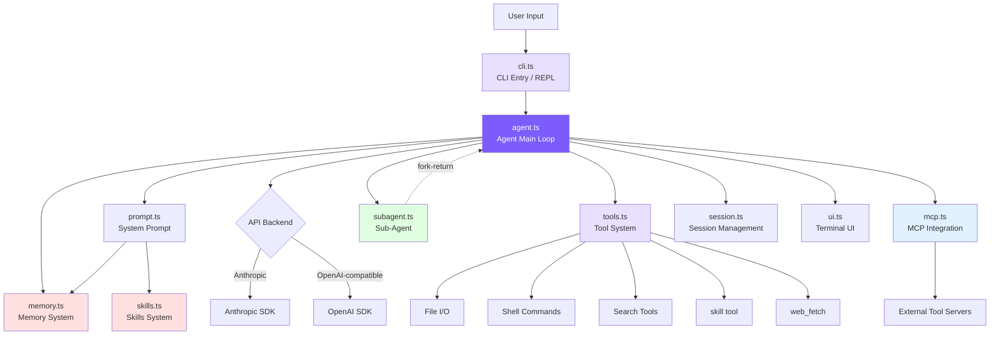

# Introduction: Building a Claude Code from an Empty Loop

## Chapter Goals

Explain what this project does, why it's worth building from scratch, and what you end up with — then get it running in five minutes.

## From "Giving Suggestions" to "Taking Action"

AI-assisted programming has gone through three phases: code completion (Copilot), chat assistant (Cursor Chat), and autonomous Agent (Claude Code). The first two share one ceiling — the model can only suggest, not act. Ask it to fix a bug and it hands back a snippet, but it can't run the tests, see the error, and revise based on the result.

Claude Code crosses that line. Say "add user registration to this project" and it searches the routes, reads the database models, creates the handler, writes tests, runs `npm test`, sees the failure, revises, and runs again — a dozen rounds until the tests pass. It isn't completing code; it's carrying out a task.

What makes this possible isn't some elaborate magic. It's a loop:

```
while (true) {
    call the model, get its reply
    reply has a tool call?  -> run the tool, feed the result back, continue
    reply is just text?     -> task done, exit
}
```

In a traditional program, the next step is written in advance by the programmer with `if/else`. This loop flips that around: the model decides the next step, and the code only keeps the loop turning and hands the tools over. That single reversal is the entire difference between a coding agent and an ordinary chatbot.

## Why Build from Scratch Instead of Reading the Source

The real Claude Code wraps that loop in half a million lines of TypeScript — 66 tools, a React/Ink terminal UI, the MCP protocol, OAuth, a multi-agent system. Reading through all of that, it's easy to drown in edge cases and abstraction layers and still not be able to say what the loop looks like.

This project goes the other way: it takes the loop out on its own and rebuilds it with the smallest amount of code, one piece at a time. The starting point is a dozen-line loop that can only chat; each chapter adds one capability, and every piece runs on its own. By the end it's an agent that reads code, edits files, runs tests, and loops until they pass — about 5,500 lines in TypeScript, about 5,000 in Python, the two mirroring each other. It's like understanding a car through a go-kart: engine, steering, brakes all there, air conditioning and stereo left out, but every important bolt tightened in plain sight.

## What Each Chapter Builds

This table is the core build line. Each row is a chapter; the right side is what the agent newly learns to do by the end of it — from "only chats" all the way to "gets work done on its own":

| Chapter | After this chapter, the agent can… |
|---|---|
| 1. Agent Loop | call tools and feed results back to itself, instead of only chatting |
| 2. Tool System | read/write files, run Shell, search code — actually change the project |
| 3. System Prompt | know what OS, directory, and Git state it's working in |
| 4. CLI & Sessions | run an interactive command line; save conversations and `--resume` them |
| 5. Streaming Output | display as it generates, and talk to OpenAI-compatible models |
| 6. Permissions & Security | ask before dangerous actions; deny rules stop overreach |
| 7. Context Management | auto-compress long conversations; run dozens of turns without overflowing |
| 8. Memory System | remember preferences and project facts across sessions, recalled on demand |
| 9. Skills System | package common operations into reusable skills, invoked as needed |
| 10. Plan Mode | present a read-only plan first, act only once approved |
| 11. Multi-Agent | fork a sub-agent for a task too big for one context, bring the result back |
| 12. MCP Integration | connect external tool servers to extend the tool set |
| 13. Architecture Comparison | line up against the real Claude Code and see where the minimal build differs |

Two chapters sit beyond this line: Chapter 14 checks whether the agent really runs, with 22 manual scenarios; Chapter 15 adds the "autonomy" trio (`/goal`, `/loop`, Auto Mode), letting the agent keep pushing a task forward and judge permissions action by action.

## What It Looks Like When Finished

Assembled, the pieces connect like this. No need to understand every box here; each later chapter adds one of them:



The main line in one sentence: input comes in, the CLI hands it to the Agent Loop, the model decides which tool to call, the code runs it and feeds the result back, and the loop turns until the model says "done." At the center, `agent.ts` is the engine (~2,169 lines) — message assembly, API calls, tool orchestration, context compression, and budget control all live here. The rest each mind one thing, none of them large:

| File | Lines | Responsibility |
|------|------|------|
| `agent.ts` | ~2169 | Agent main loop: message construction, API calls, tool orchestration, streaming execution, sub-agents, 4-layer compression, budget, Plan Mode, autonomy trio |
| `tools.ts` | ~884 | Tool definitions and execution: 12 resident tools, 6 permission modes, mtime protection, lazy loading (`/loop` dynamic additionally mounts `schedule_wakeup` temporarily) |
| `autonomy.ts` | ~464 | Autonomy trio: `/goal` evaluator, `/loop` scheduling, Auto Mode classifier |
| `cli.ts` | ~416 | CLI entry, argument parsing, REPL interaction |
| `memory.ts` | ~392 | Memory system: 4 types, file storage, semantic recall, async prefetch |
| `mcp.ts` | ~277 | MCP client: JSON-RPC over stdio, tool discovery and forwarding |
| `prompt.ts` | ~253 | System Prompt construction: template, @include, variable substitution, memory/skill injection |
| `ui.ts` | ~215 | Terminal output: color, formatting |
| `subagent.ts` | ~199 | Sub-agent config: 3 built-in types + custom agent discovery |
| `skills.ts` | ~175 | Skills system: directory discovery, frontmatter parsing, inline/fork modes |
| `session.ts` | ~63 | Session persistence: JSON file storage |
| `frontmatter.ts` | ~41 | YAML frontmatter parsing |

The Python version is a complete mirror of the same structure, in the `python/mini_claude/` package, about 5,000 lines.

## Technology Stack

The dependencies fit in one glance — no framework, no build toolchain.

<!-- tabs:start -->
#### **TypeScript**

```
TypeScript           — type-safe, same language as Claude Code
@anthropic-ai/sdk    — official Anthropic SDK
openai               — OpenAI-compatible backend support
chalk                — terminal color output
glob                 — file pattern matching
```

#### **Python**

```
Python 3.11+         — clean and readable
anthropic            — official Anthropic SDK
openai               — OpenAI-compatible backend support
```
<!-- tabs:end -->

## Get It Running

Install, give it an API key, run it — five minutes.

<!-- tabs:start -->
#### **TypeScript**

```bash
git clone https://github.com/Windy3f3f3f3f/claude-code-from-scratch.git
cd claude-code-from-scratch
npm install
export ANTHROPIC_API_KEY=sk-ant-xxx
npm run dev
```

#### **Python**

```bash
git clone https://github.com/Windy3f3f3f3f/claude-code-from-scratch.git
cd claude-code-from-scratch/python
pip install -e .
export ANTHROPIC_API_KEY=sk-ant-xxx
mini-claude-py "hello"
```
<!-- tabs:end -->

On startup:

```
  Mini Claude Code — A minimal coding agent

  Type your request, or 'exit' to quit.
  Commands: /clear /cost /compact /memory /skills /plan

>
```

Try `read src/agent.ts and explain the main loop` and watch it read the file and explain on its own.

The command line has these switches too; each is covered later where its underlying feature is built:

```bash
mini-claude --yolo "run all tests"          # skip all confirmations
mini-claude --plan "analyze this codebase"  # analyze only, no changes
mini-claude --accept-edits "refactor"       # auto-approve file edits
mini-claude --dont-ask "check style"        # auto-deny actions needing confirmation
mini-claude --auto "fix the failing test"   # Auto Mode: a classifier judges each action
mini-claude --thinking "analyze this bug"   # enable Extended Thinking
mini-claude --resume                        # resume the last session
mini-claude --max-cost 0.50 --max-turns 20  # budget control
```

## Where to Find the Corresponding Source

Each chapter explains how the minimal version is built, and points to the matching location in the real Claude Code source, so you can compare after building:

| Chapter | mini-claude file | Claude Code source |
|------|-----------------|---------------------|
| **Phase 1: Build a Working Coding Agent** | | |
| [1. Agent Loop](/en/docs/01-agent-loop.md) | `chatAnthropic()` in `agent.ts` | `queryLoop` in `src/query.ts` |
| [2. Tool System](/en/docs/02-tools.md) | `tools.ts` | `src/Tool.ts` + `src/tools/` (66+ tools) |
| [3. System Prompt](/en/docs/03-system-prompt.md) | `prompt.ts` | `src/constants/prompts.ts` |
| [4. CLI & Sessions](/en/docs/04-cli-session.md) | `cli.ts` + `session.ts` | `src/entrypoints/cli.tsx` |
| [5. Streaming Output](/en/docs/05-streaming.md) | the two stream methods in `agent.ts` | `src/services/api/claude.ts` |
| [6. Permissions & Security](/en/docs/06-permissions.md) | `checkPermission()` + rule config in `tools.ts` | `src/utils/permissions/` (52KB) |
| [7. Context Management](/en/docs/07-context.md) | `checkAndCompact()` in `agent.ts` | `src/services/compact/` |
| **Phase 2: Advanced Capabilities** | | |
| [8. Memory System](/en/docs/08-memory.md) | `memory.ts` | `src/utils/memory.ts` |
| [9. Skills System](/en/docs/09-skills.md) | `skills.ts` | `src/utils/skills.ts` + `src/tools/SkillTool/` |
| [10. Plan Mode](/en/docs/10-plan-mode.md) | `agent.ts` + `tools.ts` + `cli.ts` | `EnterPlanMode` / `ExitPlanMode` |
| [11. Multi-Agent](/en/docs/11-multi-agent.md) | `subagent.ts` + `agent.ts` | `src/tools/AgentTool/` |
| [12. MCP Integration](/en/docs/12-mcp.md) | `mcp.ts` | `src/services/mcpClient.ts` |
| [13. Architecture Comparison](/en/docs/13-whats-next.md) | global comparison | global comparison |
| **Phase 3: Autonomous Operation** | | |
| [15. Autonomy & Continuation](/en/docs/15-autonomy.md) | `autonomy.ts` | `/goal` · `/loop` · Auto Mode |

---

> **Next chapter**: start from the dumbest loop — a `while` that only chats — and turn it, step by step, into an agent that gets work done.
