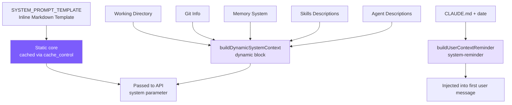

# 3. System Prompt Engineering

## Chapter Goals

Last chapter the agent got a set of tools, but it still doesn't know who it is, what environment it's working in, or when to be careful — all of which lives in the System Prompt, the first block of text assembled before every model call. This chapter builds it.

Split in two: a static core with identity, rules, and tool preferences, byte-identical across sessions (which makes it cacheable — Chapter 7 leans on that); and a dynamic half assembled each time with the current environment facts — OS, working directory, Git state, and the project's own `CLAUDE.md`.



> ▶ **Run this chapter**: `node steps/run.mjs 3` (no API key). Add `--diff` to see what it added over the previous chapter.

## Our Implementation

Last chapter's agent still used a hard-coded one-line system prompt. This chapter builds `prompt.ts`, giving it a real static core (identity, rules, tool preferences) plus a dynamic environment block. Relative to last chapter, `agent.ts` changes just one line — the hard-coded string becomes `buildSystemPrompt()`:

<!-- @diff file=agent.ts step=3 lang=ts -->
```diff
@@ -1,12 +1,8 @@
 import Anthropic from "@anthropic-ai/sdk";
 import { toolDefinitions, executeTool } from "./tools.js";
+import { buildSystemPrompt } from "./prompt.js";
 
 const MODEL = process.env.MINI_MODEL || "claude-sonnet-4-5-20250929";
 
-// A minimal, hard-coded system prompt. Chapter 3 replaces this with a real
-// static-core-plus-environment prompt built in prompt.ts.
-const SYSTEM_PROMPT =
-  "You are Mini Claude Code, a small coding assistant that helps with software " +
-  "tasks. Use the tools to read and change files. Keep answers short.";
 
 // The whole agent is one class holding a growing message array and a loop.
@@ -35,5 +31,5 @@ export class Agent {
         model: MODEL,
         max_tokens: 4096,
-        system: SYSTEM_PROMPT,
+        system: buildSystemPrompt(),
         tools: toolDefinitions,
         messages: this.messages,
```
<!-- @enddiff -->

Run it, and it now works with the full system prompt in place:

<!-- @transcript step=3 lang=ts -->
```
$ node steps/run.mjs 3
▶ step 3 demo (no API key — local mock model)   sandbox: <sandbox>
  you: Read the file greeting.txt and tell me what it says.


  → read_file({"file_path":"greeting.txt"})
greeting.txt says: hello from step one.
```
<!-- @endtranscript -->

### SYSTEM_PROMPT_TEMPLATE

The template is inline in `prompt.ts`. It IS the static core — no interpolation at all, byte-identical across sessions, which is exactly what makes it cacheable:

<!-- tabs:start -->
#### **TypeScript**
<!-- @snippet lang=ts file=prompt.ts region=static_core step=3 -->
```typescript
const STATIC_CORE = `You are Mini Claude Code, a small coding assistant CLI.
You help with software engineering tasks using the tools available to you.

# Doing tasks
 - Do not propose changes to code you haven't read. Read files first.
 - Do not create files unless necessary. Prefer editing existing files.
 - Avoid over-engineering. Only make changes that were requested.

# Executing actions with care
 - Prefer reversible actions. For risky or destructive ones (rm -rf, git push,
   dropping tables), confirm with the user before proceeding.

# Using your tools
 - Use read_file / edit_file / list_files / grep_search instead of shell cat,
   sed, ls, grep. Reserve run_shell for actual shell operations.
 - If several tool calls are independent, make them in parallel.

# Tone and style
 - Keep responses short and concise. Lead with the answer.
 - Reference code as file_path:line_number.`;
```
<!-- @endsnippet -->
#### **Python**
<!-- @snippet lang=py file=prompt.py region=static_core step=3 -->
```python
STATIC_CORE = """You are Mini Claude Code, a small coding assistant CLI.
You help with software engineering tasks using the tools available to you.

# Doing tasks
 - Do not propose changes to code you haven't read. Read files first.
 - Do not create files unless necessary. Prefer editing existing files.
 - Avoid over-engineering. Only make changes that were requested.

# Executing actions with care
 - Prefer reversible actions. For risky or destructive ones (rm -rf, git push,
   dropping tables), confirm with the user before proceeding.

# Using your tools
 - Use read_file / edit_file / list_files / grep_search instead of shell cat,
   sed, ls, grep. Reserve run_shell for actual shell operations.
 - If several tool calls are independent, make them in parallel.

# Tone and style
 - Keep responses short and concise. Lead with the answer.
 - Reference code as file_path:line_number."""
```
<!-- @endsnippet -->
<!-- tabs:end -->

The template ends here -- it contains only the **static core**: the role definition, rules, and tool descriptions that are exactly the same for every user and every session. Environment context (cwd, platform, shell, git status, memory, skills, agent list) is built separately by `buildDynamicSystemContext()` as the dynamic block that follows the static one; CLAUDE.md and the current date are wrapped in a `<system-reminder>` and injected into the first user message. This split makes way for prefix caching: once the static core is marked `cache_control`, it stays byte-identical across sessions and hits reliably, and project-specific content doesn't pollute it (see [Chapter 7: Prefix Caching](07-context.md)). Memory, skills, and the agent list sit at the end of the dynamic block -- recency bias gives these contents higher weight (see Chapters 8 and 9 for details).

### prompt.ts Implementation

<!-- tabs:start -->
#### **TypeScript**
```typescript
import { readFileSync, existsSync } from "fs";
import { join, resolve } from "path";
import { execSync } from "child_process";
import * as os from "os";
import { buildMemoryPromptSection } from "./memory.js";
import { buildSkillDescriptions } from "./skills.js";
import { buildAgentDescriptions } from "./subagent.js";
import { getDeferredToolNames } from "./tools.js";

export function loadClaudeMd(): string {
  const parts: string[] = [];
  let dir = process.cwd();
  while (true) {
    const file = join(dir, "CLAUDE.md");
    if (existsSync(file)) {
      try {
        let content = readFileSync(file, "utf-8");
        content = resolveIncludes(content, dir);  // @include resolution
        parts.unshift(content);
      } catch {}
    }
    const parent = resolve(dir, "..");
    if (parent === dir) break;
    dir = parent;
  }
  const rules = loadRulesDir(process.cwd());  // .claude/rules/*.md
  const claudeMd = parts.length > 0
    ? "\n\n# Project Instructions (CLAUDE.md)\n" + parts.join("\n\n---\n\n")
    : "";
  return claudeMd + rules;
}

export function getGitContext(): string {
  try {
    const opts = { encoding: "utf-8" as const, timeout: 3000 };
    const branch = execSync("git rev-parse --abbrev-ref HEAD", opts).trim();
    const log = execSync("git log --oneline -5", opts).trim();
    const status = execSync("git status --short", opts).trim();
    let result = `\nGit branch: ${branch}`;
    if (log) result += `\nRecent commits:\n${log}`;
    if (status) result += `\nGit status:\n${status}`;
    return result;
  } catch {
    return "";
  }
}

// Static core: return the template as-is, no interpolation -- this is the block cached via cache_control
export function buildStaticSystemPrompt(): string {
  return SYSTEM_PROMPT_TEMPLATE;
}

// Dynamic block: environment + git + memory + skills + agent list; stable within a session but varies by machine/project
export function buildDynamicSystemContext(): string {
  const platform = `${os.platform()} ${os.arch()}`;
  const shell = process.platform === "win32"
    ? (process.env.ComSpec || "cmd.exe")
    : (process.env.SHELL || "/bin/sh");
  return `# Environment
Working directory: ${process.cwd()}
Platform: ${platform}
Shell: ${shell}${getGitContext()}${buildMemoryPromptSection()}${buildSkillDescriptions()}${buildAgentDescriptions()}`;
}

// CLAUDE.md + date: wrapped in <system-reminder>, injected into the first user message by the agent
export function buildUserContextReminder(): string {
  const date = new Date().toISOString().split("T")[0];
  const claudeMd = loadClaudeMd();
  return `<system-reminder>\n...${claudeMd}\n# currentDate\nToday's date is ${date}.\n...</system-reminder>`;
}
```
#### **Python**
```python
import os
import platform
import subprocess
from pathlib import Path


def load_claude_md() -> str:
    parts: list[str] = []
    d = Path.cwd().resolve()
    while True:
        f = d / "CLAUDE.md"
        if f.is_file():
            try:
                content = f.read_text()
                content = resolve_includes(content, str(d))  # @include resolution
                parts.insert(0, content)
            except Exception:
                pass
        parent = d.parent
        if parent == d:
            break
        d = parent
    rules = load_rules_dir(str(Path.cwd()))  # .claude/rules/*.md
    claude_md = "\n\n# Project Instructions (CLAUDE.md)\n" + "\n\n---\n\n".join(parts) if parts else ""
    return claude_md + rules


def get_git_context() -> str:
    try:
        opts = {"encoding": "utf-8", "timeout": 3, "capture_output": True}
        branch = subprocess.run(["git", "rev-parse", "--abbrev-ref", "HEAD"], **opts).stdout.strip()
        log = subprocess.run(["git", "log", "--oneline", "-5"], **opts).stdout.strip()
        status = subprocess.run(["git", "status", "--short"], **opts).stdout.strip()
        result = f"\nGit branch: {branch}"
        if log:
            result += f"\nRecent commits:\n{log}"
        if status:
            result += f"\nGit status:\n{status}"
        return result
    except Exception:
        return ""


def build_static_system_prompt() -> str:
    # Static core: return the template as-is -- this is the block cached via cache_control
    return SYSTEM_PROMPT_TEMPLATE


def build_dynamic_system_context() -> str:
    # Dynamic block: environment + git + memory + skills + agent list
    plat = f"{platform.system()} {platform.machine()}"
    shell = os.environ.get("SHELL", "/bin/sh")
    return (
        f"# Environment\n"
        f"Working directory: {Path.cwd()}\n"
        f"Platform: {plat}\n"
        f"Shell: {shell}"
        f"{get_git_context()}{build_memory_prompt_section()}"
        f"{build_skill_descriptions()}{build_agent_descriptions()}"
    )


def build_user_context_reminder() -> str:
    # CLAUDE.md + date: wrapped in <system-reminder>, injected into the first user message by the agent
    from datetime import date
    return (
        "<system-reminder>\n..."
        f"{load_claude_md()}\n"
        f"# currentDate\nToday's date is {date.today().isoformat()}.\n"
        "...</system-reminder>"
    )
```
<!-- tabs:end -->

### Simplification Trade-offs

| Claude Code | mini-claude | Reason |
|------------|-------------|--------|
| Static/Dynamic cache boundary | static/dynamic split + cache_control on static block | See [Chapter 7: Prefix Caching](07-context.md) |
| CLAUDE.md 5-layer discovery + .claude subdirectory | Traverse upward from CWD + .claude/rules/ | Covers common scenarios |
| @include directive | Supports @./path, @~/path, @/path | Full implementation |
| Anti-pattern inoculation (3 rules) | Fully preserved | Huge impact on output quality |
| Blast radius framework | Fully preserved | Security cannot be simplified |
| Tool preference mapping table | Adapted to tool names, preserved | Essential -- otherwise the model defaults to bash |
| Deferred tool name injection | getDeferredToolNames() | Tells the model which tools can be activated on demand |

### @include Syntax and Rules Auto-Loading

CLAUDE.md files support `@` syntax to reference external files, enabling modular project configuration. Additionally, rule files in the `.claude/rules/*.md` directory are auto-loaded.

<!-- tabs:start -->
#### **TypeScript**
```typescript
// prompt.ts -- @include resolution

const INCLUDE_REGEX = /^@(\.\/[^\s]+|~\/[^\s]+|\/[^\s]+)$/gm;
const MAX_INCLUDE_DEPTH = 5;

function resolveIncludes(
  content: string,
  basePath: string,
  visited: Set<string> = new Set(),
  depth: number = 0
): string {
  if (depth >= MAX_INCLUDE_DEPTH) return content;
  return content.replace(INCLUDE_REGEX, (_match, rawPath: string) => {
    let resolved: string;
    if (rawPath.startsWith("~/")) {
      resolved = join(os.homedir(), rawPath.slice(2));
    } else if (rawPath.startsWith("/")) {
      resolved = rawPath;
    } else {
      resolved = resolve(basePath, rawPath);  // ./relative
    }
    resolved = resolve(resolved);
    if (visited.has(resolved)) return `<!-- circular: ${rawPath} -->`;
    if (!existsSync(resolved)) return `<!-- not found: ${rawPath} -->`;
    try {
      visited.add(resolved);
      const included = readFileSync(resolved, "utf-8");
      return resolveIncludes(included, dirname(resolved), visited, depth + 1);
    } catch {
      return `<!-- error reading: ${rawPath} -->`;
    }
  });
}
```
<!-- tabs:end -->

Three path formats:
- `@./relative/path` -- Relative to the directory containing the current CLAUDE.md
- `@~/path` -- Relative to the user's home directory
- `@/absolute/path` -- Absolute path

Safeguards:
- **visited Set** prevents circular references (A includes B, B includes A)
- **MAX_INCLUDE_DEPTH = 5** prevents excessive nesting
- Missing files leave an HTML comment marker rather than erroring out

`.claude/rules/*.md` auto-loading:

<!-- tabs:start -->
#### **TypeScript**
```typescript
// prompt.ts -- Rules directory loading

function loadRulesDir(dir: string): string {
  const rulesDir = join(dir, ".claude", "rules");
  if (!existsSync(rulesDir)) return "";
  const files = readdirSync(rulesDir).filter(f => f.endsWith(".md")).sort();
  const parts: string[] = [];
  for (const file of files) {
    let content = readFileSync(join(rulesDir, file), "utf-8");
    content = resolveIncludes(content, rulesDir);  // Rule files also support @include
    parts.push(`<!-- rule: ${file} -->\n${content}`);
  }
  return parts.length > 0 ? "\n\n## Rules\n" + parts.join("\n\n") : "";
}
```
<!-- tabs:end -->

Usage example:

```markdown
# CLAUDE.md
@./.claude/rules/chinese-greeting.md
@./docs/coding-style.md

This project uses TypeScript with strict mode.
```

After loading, references are replaced with file contents. This lets teams put shared rules in the `.claude/rules/` directory, and CLAUDE.md only needs a one-line reference.

loadClaudeMd integrates all three: upward CLAUDE.md traversal + @include resolution + rules directory:

```typescript
export function loadClaudeMd(): string {
  const parts: string[] = [];
  let dir = process.cwd();
  while (true) {
    const file = join(dir, "CLAUDE.md");
    if (existsSync(file)) {
      let content = readFileSync(file, "utf-8");
      content = resolveIncludes(content, dir);  // Each CLAUDE.md resolves @include
      parts.unshift(content);
    }
    const parent = resolve(dir, "..");
    if (parent === dir) break;
    dir = parent;
  }
  const rules = loadRulesDir(process.cwd());
  const claudeMd = parts.length > 0
    ? "\n\n# Project Instructions (CLAUDE.md)\n" + parts.join("\n\n---\n\n")
    : "";
  return claudeMd + rules;
}
```

---

## What the Real Claude Code Does Beyond This

Our prompt got by on a static core plus one block of environment info. Claude Code's System Prompt is an engineering artifact, iteratively refined through extensive A/B testing and model behavior observation — and what it adds is taking "make the model reliably do as told" to its limit.

### 7-Layer Progressive Structure

The prompt is organized from abstract to concrete in 7 layers -- **first establishing the identity and constraint framework, then filling in specific behavioral guidance**. This order matters: concepts the model establishes first become the framework for understanding subsequent content.

```
1. Identity   -> Who am I? interactive agent
2. System     -> Basic facts about the runtime environment
3. Doing Tasks -> How to write code? (anti-pattern inoculation)
4. Actions    -> Which operations need confirmation? (blast radius framework)
5. Using Tools -> How to use tools? (preference mapping table)
6. Tone & Style -> What output format?
7. Output Efficiency -> How to be more concise?
```

### Anti-Pattern Inoculation

**Explicitly telling the model "what not to do" is far more effective than only describing "what to do."**

Positive instructions ("be concise") leave room for the model to self-rationalize -- it may think "adding comments makes code more concise and readable," then add docstrings to every function. Negative instructions ("don't add docstrings to code you didn't change") eliminate room for interpretation.

Claude Code's Doing Tasks section has three precise "don'ts":

- **Don't expand scope**: Fixing a bug doesn't mean refactoring surrounding code
- **Don't code defensively**: Don't add try-catch and validation for impossible scenarios
- **Don't abstract prematurely**: "Three similar lines of code is better than a premature abstraction"

The value of these rules is not in the concepts (everyone knows "don't over-engineer"), but in the **precision of the wording** -- giving the model specific judgment criteria rather than vague principles.

### Blast Radius Framework

The Actions section doesn't enumerate "can't do X, Y, Z" -- instead it teaches the model a **risk assessment framework**:

```
Carefully consider the reversibility and blast radius of actions.
```

A two-dimensional model: **reversibility x impact scope**. High risk = irreversible + affects shared environments (force push, deleting cloud resources); low risk = reversible + local impact only (editing local files).

This scales far better than exhaustive rules -- when the model encounters a new scenario not on the rule list (like calling an API to delete cloud resources), it can reason on its own rather than not knowing what to do.

There's also a critical rule: a user approving one operation does not mean they approve all similar operations. Each authorization is valid only for the current scope.

### Tool Preference Mapping Table

Claude Code explicitly requires the model to use dedicated tools rather than bash commands in the prompt:

```
Use Read instead of cat/head/tail
Use Edit instead of sed/awk
Use Glob instead of find/ls
Use Grep instead of grep/rg
```

Dedicated tools and bash commands are functionally similar at the low level; the difference is in user experience: permissions can be fine-grained (separate authorization for reads vs. writes), output is structured, and parallel calling is natively supported. Without this mapping table, the model defaults to what appears most in training data -- various bash commands.

### CLAUDE.md Hierarchical Discovery

CLAUDE.md is a project-level instruction file, similar to `.eslintrc` but for AI. Claude Code loads it from 5 locations: global admin policy -> user home directory -> project directory (traversing upward from CWD) -> local files -> command-line specified directory.

Files closer to CWD are **loaded later with higher priority** -- leveraging the LLM's recency bias, subdirectory rules can override parent directory rules.


---

> **Next chapter**: With tools and prompts in place, the next step is making the agent interactive -- CLI entry, REPL loop, and session persistence.
