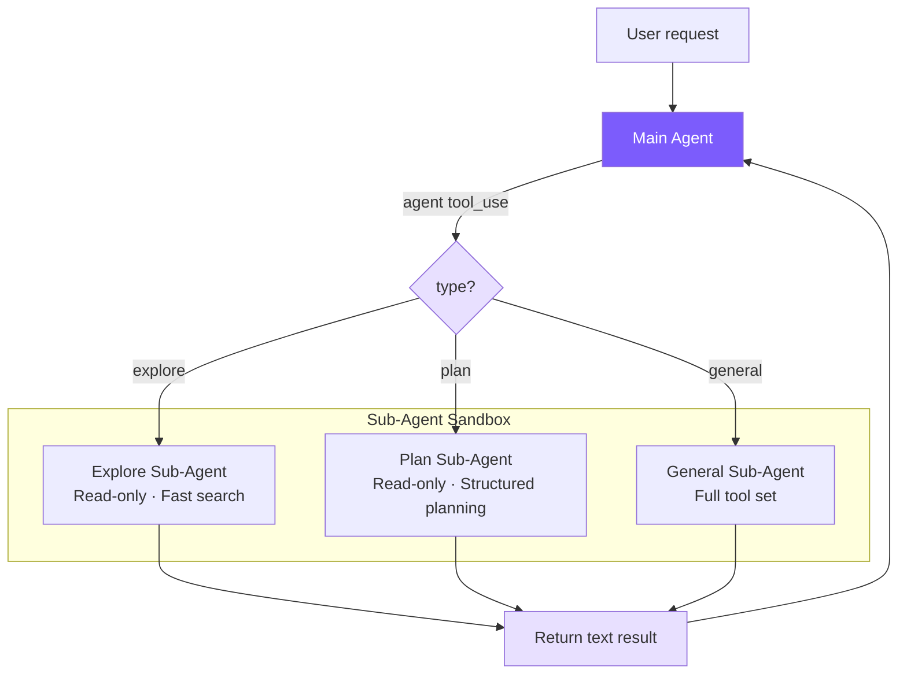

# 11. Multi-Agent Architecture

## Chapter Goals

Plan Mode makes the agent plan before acting, but no amount of planning gets around one thing: cram a big task into one agent and the context fills up fast. This chapter builds sub-agents so the main agent can farm work out.

The main agent spawns an independent sub-agent to chew on a sub-task — exploring code, planning, or general work. The sub-agent has its own clean context and brings back only the result, instead of pouring all the intermediate steps back into the main conversation. That's divide and conquer, and it's the way out when the main agent's context runs short.



> ▶ **Run this chapter**: `node steps/run.mjs 11` (no API key) — watch the main agent send a sub-agent to check a file. Add `--diff` to see what it added over the previous chapter. To run your own prompt against a real model, add `--live` (it reads the key from `.env`; `--py` runs the Python version).

## Our Implementation

Cram a big task into one agent and the context fills up fast. This chapter builds sub-agents: the main agent, through an `agent` tool, forks an independent sub-agent to chew on a sub-task — the sub-agent has its own clean context, runs a small read-only loop in-process (recursion), and brings back only the result. Relative to last chapter, it adds a `subagent.ts`, and the agent loop intercepts the `agent` tool:

<!-- tabs:start -->
#### **TypeScript**
<!-- @diff file=agent.ts step=11 lang=ts -->
```diff
@@ -5,4 +5,5 @@ import { checkPermission } from "./permissions.js";
 import { maybeCompact } from "./context.js";
 import { recallMemories } from "./memory.js";
+import { runSubAgent } from "./subagent.js";
 
 const MODEL = process.env.MINI_MODEL || "claude-sonnet-4-5-20250929";
@@ -65,4 +66,10 @@ export class Agent {
       for (const tu of toolUses) {
         console.log(`  → ${tu.name}(${JSON.stringify(tu.input)})`);
+        // The `agent` tool forks a read-only sub-agent with its own context.
+        if (tu.name === "agent") {
+          const summary = await runSubAgent(String((tu.input as any).task || ""), this.client, MODEL);
+          results.push({ type: "tool_result", tool_use_id: tu.id, content: summary });
+          continue;
+        }
         // Plan mode is read-only: writes and shell are denied on top of the gate.
         const blocked = checkPermission(tu.name, tu.input as Record<string, any>) === "deny"
```
<!-- @enddiff -->
#### **Python**
<!-- @diff file=agent.py step=11 lang=py -->
```diff
@@ -9,4 +9,5 @@ from permissions import check_permission
 from context import maybe_compact
 from memory import recall_memories
+from subagent import run_sub_agent
 
 MODEL = os.environ.get("MINI_MODEL", "claude-sonnet-4-5-20250929")
@@ -62,4 +63,9 @@ class Agent:
             for tu in tool_uses:
                 print(f"  → {tu.name}({json.dumps(tu.input)})")
+                # The `agent` tool forks a read-only sub-agent with its own context.
+                if tu.name == "agent":
+                    summary = run_sub_agent(tu.input.get("task", ""), self.client, MODEL)
+                    results.append({"type": "tool_result", "tool_use_id": tu.id, "content": summary})
+                    continue
                 # Plan mode is read-only: writes and shell are denied on top of the gate.
                 blocked = check_permission(tu.name, tu.input) == "deny" or (
```
<!-- @enddiff -->
<!-- tabs:end -->

A sub-agent is just a read-only mini-loop — give it only the read tools, and report back the final text when it is done:

<!-- tabs:start -->
#### **TypeScript**
<!-- @snippet lang=ts file=subagent.ts region=subagent step=11 -->
```typescript
export async function runSubAgent(task: string, client: Anthropic, model: string): Promise<string> {
  const messages: Anthropic.MessageParam[] = [{ role: "user", content: task }];
  const tools = toolDefinitions.filter((t) => EXPLORE_TOOLS.includes(t.name));

  while (true) {
    const reply = await client.messages.create({
      model, max_tokens: 4096,
      system: "You are an explore sub-agent. Investigate read-only and report back a concise summary.",
      tools, messages,
    });
    messages.push({ role: "assistant", content: reply.content });

    const toolUses = reply.content.filter((b): b is Anthropic.ToolUseBlock => b.type === "tool_use");
    if (toolUses.length === 0) {
      return reply.content.filter((b) => b.type === "text").map((b: any) => b.text).join("");
    }
    const results: Anthropic.ToolResultBlockParam[] = [];
    for (const tu of toolUses) {
      // Read-only: a sub-agent can look but not touch.
      const output = EXPLORE_TOOLS.includes(tu.name)
        ? await executeTool(tu.name, tu.input as Record<string, any>)
        : `Denied: the sub-agent is read-only.`;
      results.push({ type: "tool_result", tool_use_id: tu.id, content: output });
    }
    messages.push({ role: "user", content: results });
  }
}
```
<!-- @endsnippet -->
#### **Python**
<!-- @snippet lang=py file=subagent.py region=subagent step=11 -->
```python
def run_sub_agent(task, client, model):
    messages = [{"role": "user", "content": task}]
    tools = [t for t in tool_definitions if t["name"] in EXPLORE_TOOLS]

    while True:
        reply = client.messages.create(
            model=model, max_tokens=4096,
            system="You are an explore sub-agent. Investigate read-only and report back a concise summary.",
            tools=tools, messages=messages,
        )
        messages.append({"role": "assistant", "content": reply.content})

        tool_uses = [b for b in reply.content if b.type == "tool_use"]
        if not tool_uses:
            return "".join(b.text for b in reply.content if b.type == "text")
        results = []
        for tu in tool_uses:
            # Read-only: a sub-agent can look but not touch.
            output = execute_tool(tu.name, tu.input) if tu.name in EXPLORE_TOOLS \
                else "Denied: the sub-agent is read-only."
            results.append({"type": "tool_result", "tool_use_id": tu.id, "content": output})
        messages.append({"role": "user", "content": results})
```
<!-- @endsnippet -->
<!-- tabs:end -->

Run it: the main agent sends a sub-agent to read `greeting.txt`, the sub-agent reports back, and the main agent answers:

<!-- @transcript step=11 lang=ts -->
```
$ node steps/run.mjs 11
▶ step 11 demo (no API key — local mock model)   sandbox: <sandbox>
  you: Use a sub-agent to find out what greeting.txt says.


  → agent({"task":"Read greeting.txt and report its contents."})
The sub-agent reports greeting.txt says: hello from the subagent demo.
```
<!-- @endtranscript -->

> That is the whole runnable step for this chapter — everything `node steps/run.mjs` actually executes here is above. Below is how the repo's production mini-claude does the same thing in full: more edge cases and engineering detail. Read it as an **optional deep-dive**; it is not the code the runnable step runs.

With **~199 lines** in `subagent.ts` plus minor changes to the Agent class, we implement the core of the Sub-Agent pattern.

| Claude Code | Our Implementation | Simplification Reason |
|-------------|-------------------|----------------------|
| 5-stage execution pipeline | Direct new Agent + runOnce | No need for fork processes, cache sharing |
| 4-layer tool filter pipeline | 1 Set + filter | Only 3 fixed types |
| Haiku model for Explore | Unified main model | Reduces configuration complexity |
| deny-by-default context isolation | Natural isolation (independent Agent instances) | new Agent comes with independent message history |

## Key Code

### 1. Agent Type Configuration -- `subagent.ts`

<!-- tabs:start -->
#### **TypeScript**
```typescript
export type SubAgentType = "explore" | "plan" | "general";

const READ_ONLY_TOOLS = new Set([
  "read_file", "list_files", "grep_search"
]);

function getReadOnlyTools(): ToolDef[] {
  return toolDefinitions.filter((t) => READ_ONLY_TOOLS.has(t.name));
}
```
#### **Python**
```python
READ_ONLY_TOOLS = {"read_file", "list_files", "grep_search"}

def _get_read_only_tools() -> list[ToolDef]:
    return [t for t in tool_definitions if t["name"] in READ_ONLY_TOOLS]
```
<!-- tabs:end -->

Why no shell at all? Explore only does code exploration, and `read_file`, `list_files`, and `grep_search` are enough — so we simply don't include `run_shell`, cutting off any chance of a destructive command at the tool layer, which is safer than a prompt reminding it to "only run read-only commands." The system prompt restates the read-only contract too:

<!-- tabs:start -->
#### **TypeScript**
```typescript
const EXPLORE_PROMPT = `You are an Explore agent — a fast, READ-ONLY sub-agent...

IMPORTANT CONSTRAINTS:
- You are READ-ONLY. You only have access to read_file, list_files, and grep_search.
- Do NOT modify any files.

Be fast and thorough. Use multiple tool calls when possible.
Return a concise summary of your findings.`;
```
#### **Python**
```python
EXPLORE_PROMPT = """You are an Explore agent — a fast, READ-ONLY sub-agent specialized for codebase exploration.

IMPORTANT CONSTRAINTS:
- You are READ-ONLY. You only have access to read_file, list_files, and grep_search.
- Do NOT attempt to modify any files.

Be fast and thorough. Use multiple tool calls when possible. Return a concise summary of your findings."""
```
<!-- tabs:end -->

The Plan Agent is also read-only, but its prompt guides it to produce structured plans:

<!-- tabs:start -->
#### **TypeScript**
```typescript
const PLAN_PROMPT = `You are a Plan agent — a READ-ONLY sub-agent specialized for designing implementation plans.

Your job:
- Analyze the codebase to understand the current architecture
- Design a step-by-step implementation plan
- Identify critical files that need modification
- Consider architectural trade-offs

Return a structured plan with:
1. Summary of current state
2. Step-by-step implementation steps
3. Critical files for implementation
4. Potential risks or considerations`;
```
#### **Python**
```python
PLAN_PROMPT = """You are a Plan agent — a READ-ONLY sub-agent specialized for designing implementation plans.

Return a structured plan with:
1. Summary of current state
2. Step-by-step implementation steps
3. Critical files for implementation
4. Potential risks or considerations"""
```
<!-- tabs:end -->

The General Agent gets all tools except `agent`:

<!-- tabs:start -->
#### **TypeScript**
```typescript
const GENERAL_PROMPT = `You are a General sub-agent handling an independent task.
Complete the assigned task and return a concise result. You have access to all tools.`;

export function getSubAgentConfig(type: SubAgentType): SubAgentConfig {
  // Check custom agents first
  const custom = discoverCustomAgents().get(type);
  if (custom) {
    const tools = custom.allowedTools
      ? toolDefinitions.filter(t => custom.allowedTools!.includes(t.name))
      : toolDefinitions.filter(t => t.name !== "agent");
    return { systemPrompt: custom.systemPrompt, tools };
  }
  switch (type) {
    case "explore":
      return { systemPrompt: EXPLORE_PROMPT, tools: getReadOnlyTools() };
    case "plan":
      return { systemPrompt: PLAN_PROMPT, tools: getReadOnlyTools() };
    case "general":
      return {
        systemPrompt: GENERAL_PROMPT,
        tools: toolDefinitions.filter((t) => t.name !== "agent"),
      };
  }
}
```
#### **Python**
```python
GENERAL_PROMPT = "You are a General sub-agent handling an independent task. Complete the assigned task and return a concise result. You have access to all tools."

def get_sub_agent_config(agent_type: str) -> dict:
    custom = _discover_custom_agents().get(agent_type)
    if custom:
        if custom["allowed_tools"]:
            tools = [t for t in tool_definitions if t["name"] in custom["allowed_tools"]]
        else:
            tools = [t for t in tool_definitions if t["name"] != "agent"]
        return {"system_prompt": custom["system_prompt"], "tools": tools}

    read_only = [t for t in tool_definitions if t["name"] in READ_ONLY_TOOLS]
    if agent_type == "explore":
        return {"system_prompt": EXPLORE_PROMPT, "tools": read_only}
    elif agent_type == "plan":
        return {"system_prompt": PLAN_PROMPT, "tools": read_only}
    else:
        return {"system_prompt": GENERAL_PROMPT, "tools": [t for t in tool_definitions if t["name"] != "agent"]}
```
<!-- tabs:end -->

### 2. Agent Tool Definition -- `tools.ts`

`agent` is registered as a regular tool. `type` is not required -- when the LLM is unsure, it can omit it and fall back to `general`:

<!-- tabs:start -->
#### **TypeScript**
```typescript
{
  name: "agent",
  description:
    "Launch a sub-agent to handle a task autonomously. Sub-agents have isolated context " +
    "and return their result. Types: 'explore' (read-only, fast search), " +
    "'plan' (read-only, structured planning), 'general' (full tools).",
  input_schema: {
    type: "object",
    properties: {
      description: { type: "string", description: "Short (3-5 word) description of the sub-agent's task" },
      prompt: { type: "string", description: "Detailed task instructions for the sub-agent" },
      type: {
        type: "string",
        enum: ["explore", "plan", "general"],
        description: "Agent type. Default: general",
      },
    },
    required: ["description", "prompt"],
  },
}
```
#### **Python**
```python
{
    "name": "agent",
    "description": "Launch a sub-agent to handle a task autonomously. Types: 'explore' (read-only), 'plan' (read-only, structured planning), 'general' (full tools).",
    "input_schema": {
        "type": "object",
        "properties": {
            "description": {"type": "string", "description": "Short (3-5 word) description of the sub-agent's task"},
            "prompt": {"type": "string", "description": "Detailed task instructions for the sub-agent"},
            "type": {"type": "string", "enum": ["explore", "plan", "general"], "description": "Agent type. Default: general"},
        },
        "required": ["description", "prompt"],
    },
}
```
<!-- tabs:end -->

### 3. Agent Class Modifications -- `agent.ts`

Only 4 changes are needed to make the same Agent class serve both the main Agent and sub-agents.

#### 3a. Constructor: Accept Custom Configuration

<!-- tabs:start -->
#### **TypeScript**
```typescript
interface AgentOptions {
  // ...
  customSystemPrompt?: string;
  customTools?: ToolDef[];
  isSubAgent?: boolean;
}

constructor(options: AgentOptions = {}) {
  this.isSubAgent = options.isSubAgent || false;
  this.tools = options.customTools || toolDefinitions;
  this.systemPrompt = options.customSystemPrompt || buildSystemPrompt();
  // ...
}
```
#### **Python**
```python
class Agent:
    def __init__(
        self,
        *,
        # ...
        custom_system_prompt: str | None = None,
        custom_tools: list[ToolDef] | None = None,
        is_sub_agent: bool = False,
    ):
        self.is_sub_agent = is_sub_agent
        self.tools = custom_tools or tool_definitions
        self._base_system_prompt = custom_system_prompt or build_system_prompt()
```
<!-- tabs:end -->

When `customTools` is `None`, it falls back to the full tool list, with zero impact on the main Agent.

#### 3b. Output Capture: emitText + outputBuffer

Sub-agent text output can't be printed directly; it needs to be collected and returned to the main Agent:

<!-- tabs:start -->
#### **TypeScript**
```typescript
private outputBuffer: string[] | null = null;

private emitText(text: string): void {
  if (this.outputBuffer) {
    this.outputBuffer.push(text);   // Sub-agent: collect
  } else {
    printAssistantText(text);        // Main Agent: print directly
  }
}
```
#### **Python**
```python
self._output_buffer: list[str] | None = None

def _emit_text(self, text: str) -> None:
    if self._output_buffer is not None:
        self._output_buffer.append(text)
    else:
        print_assistant_text(text)
```
<!-- tabs:end -->

`outputBuffer` has three states: `null` = main Agent mode (print directly), `[]` = sub-agent mode (start collecting), `[...]` = accumulating. The streaming callback only needs to call `emitText`, completely unaware of which mode it's running in.

#### 3c. runOnce: One-Shot Execution Entry Point

<!-- tabs:start -->
#### **TypeScript**
```typescript
async runOnce(prompt: string): Promise<{ text: string; tokens: { input: number; output: number } }> {
  this.outputBuffer = [];
  const prevInput = this.totalInputTokens;
  const prevOutput = this.totalOutputTokens;
  await this.chat(prompt);                         // Reuse the full agent loop
  const text = this.outputBuffer.join("");
  this.outputBuffer = null;
  return {
    text,
    tokens: {
      input: this.totalInputTokens - prevInput,
      output: this.totalOutputTokens - prevOutput,
    },
  };
}
```
#### **Python**
```python
async def run_once(self, prompt: str) -> dict:
    self._output_buffer = []
    prev_in = self.total_input_tokens
    prev_out = self.total_output_tokens
    await self.chat(prompt)
    text = "".join(self._output_buffer)
    self._output_buffer = None
    return {
        "text": text,
        "tokens": {
            "input": self.total_input_tokens - prev_in,
            "output": self.total_output_tokens - prev_out,
        },
    }
```
<!-- tabs:end -->

Tokens are calculated incrementally (post-run minus pre-run) because the Agent instance's counters are cumulative. `chat()` is fully reused -- it doesn't care whether it's running in the main Agent or a sub-agent, since the tool set and output destination were already configured in the constructor.

#### 3d. executeAgentTool: Execute Sub-Agent

<!-- tabs:start -->
#### **TypeScript**
```typescript
private async executeAgentTool(input: Record<string, any>): Promise<string> {
  const type = (input.type || "general") as SubAgentType;
  const description = input.description || "sub-agent task";
  const prompt = input.prompt || "";

  printSubAgentStart(type, description);

  const config = getSubAgentConfig(type);
  const subAgent = new Agent({
    model: this.model,
    customSystemPrompt: config.systemPrompt,
    customTools: config.tools,
    isSubAgent: true,
    permissionMode: this.permissionMode === "plan" ? "plan" : "bypassPermissions",
  });

  try {
    const result = await subAgent.runOnce(prompt);
    this.totalInputTokens += result.tokens.input;
    this.totalOutputTokens += result.tokens.output;
    printSubAgentEnd(type, description);
    return result.text || "(Sub-agent produced no output)";
  } catch (e: any) {
    printSubAgentEnd(type, description);
    return `Sub-agent error: ${e.message}`;
  }
}
```
#### **Python**
```python
async def _execute_agent_tool(self, inp: dict) -> str:
    agent_type = inp.get("type", "general")
    description = inp.get("description", "sub-agent task")
    prompt = inp.get("prompt", "")

    print_sub_agent_start(agent_type, description)

    config = get_sub_agent_config(agent_type)
    sub_agent = Agent(
        model=self.model,
        custom_system_prompt=config["system_prompt"],
        custom_tools=config["tools"],
        is_sub_agent=True,
        permission_mode="plan" if self.permission_mode == "plan" else "bypassPermissions",
    )

    try:
        result = await sub_agent.run_once(prompt)
        self.total_input_tokens += result["tokens"]["input"]
        self.total_output_tokens += result["tokens"]["output"]
        print_sub_agent_end(agent_type, description)
        return result["text"] or "(Sub-agent produced no output)"
    except Exception as e:
        print_sub_agent_end(agent_type, description)
        return f"Sub-agent error: {e}"
```
<!-- tabs:end -->

When a sub-agent errors, it returns an error string rather than crashing the parent Agent -- the parent Agent's LLM sees the error message and can decide on its own whether to retry or try a different strategy.

Permission inheritance: Sub-agents default to `bypassPermissions` (the main Agent has already been authorized, so sub-agents don't need to ask the user again), but Plan Mode must be inherited -- otherwise sub-agents could bypass the read-only restriction, which would be a security hole.

The `agent` tool requires special dispatch because it needs access to the current Agent instance's state (model, permissionMode, token counters) and can't go through the stateless generic dispatch function:

<!-- tabs:start -->
#### **TypeScript**
```typescript
private async executeToolCall(name: string, input: Record<string, any>): Promise<string> {
  if (name === "agent") {
    return this.executeAgentTool(input);
  }
  return executeTool(name, input);
}
```
#### **Python**
```python
async def _execute_tool_call(self, name: str, inp: dict) -> str:
    if name == "agent":
        return await self._execute_agent_tool(inp)
    if name == "skill":
        return await self._execute_skill_tool(inp)
    return await execute_tool(name, inp)
```
<!-- tabs:end -->

### 4. The isSubAgent Flag

Sub-agents skip three operations that are only meaningful for the main Agent:

<!-- tabs:start -->
#### **TypeScript**
```typescript
if (!this.isSubAgent) {
  printDivider();
  this.autoSave();
}

if (!this.isSubAgent) {
  printCost(this.totalInputTokens, this.totalOutputTokens);
}
```
#### **Python**
```python
if not self.is_sub_agent:
    print_divider()
    self._auto_save()

if not self.is_sub_agent:
    print_cost(self.total_input_tokens, self.total_output_tokens)
```
<!-- tabs:end -->

- Dividers: Sub-agent output is captured by the buffer and won't appear in the terminal
- Session saving: Sub-agents are one-time tasks; saving their session is pointless and could overwrite the main Agent's file
- Cost printing: Tokens are already aggregated to the parent Agent; sub-agents printing their own cost would create a false impression of double billing

### 5. Terminal UI -- `ui.ts`

<!-- tabs:start -->
#### **TypeScript**
```typescript
export function printSubAgentStart(type: string, description: string) {
  console.log(chalk.magenta(`\n  ┌─ Sub-agent [${type}]: ${description}`));
}

export function printSubAgentEnd(type: string, description: string) {
  console.log(chalk.magenta(`  └─ Sub-agent [${type}] completed`));
}
```
#### **Python**
```python
def print_sub_agent_start(agent_type: str, description: str) -> None:
    console.print(f"\n  [magenta]┌─ Sub-agent [{agent_type}]: {description}[/magenta]")

def print_sub_agent_end(agent_type: str, _description: str) -> None:
    console.print(f"  [magenta]└─ Sub-agent [{agent_type}] completed[/magenta]")
```
<!-- tabs:end -->

### 6. Custom Agent Types: `.claude/agents/*.md`

An extension mechanism identical to Claude Code's `.claude/agents/`:

```markdown
<!-- .claude/agents/reviewer.md -->
---
name: reviewer
description: Reviews code for bugs and style issues
allowed-tools: read_file, list_files, grep_search, run_shell
---
You are a code reviewer. Analyze the code thoroughly and report:
1. Bugs and potential issues
2. Style inconsistencies
3. Performance concerns
```

Discovery mechanism: Project-level (`.claude/agents/`) has higher priority than user-level (`~/.claude/agents/`), with same-name override. Frontmatter reuses `parseFrontmatter()`, sharing the same parser with Memory and Skills.

## What the Real Claude Code Does Beyond This

Our sub-agents have just one mode: fork-return — send one out, get a result back. Claude Code's multi-agent system also has coordinator and swarm modes, where agents communicate peer-to-peer and explore in parallel.

Claude Code's multi-agent system is implemented in `src/tools/AgentTool/`, supporting three collaboration modes:

| Mode | Characteristics |
|------|----------------|
| **Sub-Agent** (fork-return) | Forks to execute independently, returns result on completion |
| **Coordinator** | A coordinator assigns tasks to multiple Workers |
| **Swarm Team** | Multiple Agents collaborate as peers, communicating via mailboxes |

We implement the Sub-Agent mode, which is also the most commonly used.

### Built-in Agent Types

- **Explore**: Uses Haiku model (cheaper), read-only tool set, specialized for code search
- **Plan**: Read-only + structured output, designs implementation plans
- **General**: Full tool set (except it cannot recursively create sub-agents)
- **Custom**: Defined via `.claude/agents/*.md` files

### Key Design of Coordinator Mode

Coordinator turns the main Agent into a **pure orchestrator** -- its tool set is hard-limited to only `Agent` (spawn Workers) and `SendMessage` (continue a Worker), with absolutely no ability to perform file operations. This hard constraint prevents the coordinator from "being too lazy to delegate and doing it itself," which would cause it to degrade into a regular single Agent.

The standard workflow has four phases: **Research (parallel, read-only) -> Synthesize (coordinator, serial comprehension) -> Implement (serial, by file set) -> Verify**.

The synthesis phase has a counter-intuitive constraint: the prompt explicitly forbids writing "based on your findings." This forces the coordinator to genuinely understand and make research results concrete (including file paths, line numbers), rather than passing the comprehension work to the next Worker.

Each Worker is an independent Agent starting from scratch that cannot see the coordinator's conversation with the user, so the prompt the coordinator writes for Workers must be self-contained -- this is the biggest pitfall in Coordinator mode.

### Tool Filtering: 4-Layer Pipeline

Sub-agent tool access goes through a 4-layer filter, implementing defense in depth:

1. Remove meta-tools (`TaskOutput`, `EnterPlanMode`, `AskUserQuestion`, etc.) -- sub-agents should not control Agent execution flow
2. Additional restrictions for custom Agents -- user-defined types don't get the same trust level as built-in types
3. Async Agents use a whitelist mode -- background execution can't display interactive UI, requiring strict limits
4. Agent-type-level `disallowedTools` -- e.g., Explore explicitly excludes write tools

The first three layers are global policies; the fourth is type-level policy. Even if a custom Agent sets `disallowedTools: []`, the first three layers still apply.

### Context Isolation

Sub-agents use deny-by-default: message history is completely independent, `abortController` propagates one-way (parent abort -> child abort, but not the reverse), and sub-agent state changes don't propagate to the parent UI by default. There's only one exception: background processes started by Bash must be registered in the root store, or they become zombie processes.

### Worktree Isolation

When multiple Agents write files in parallel, Claude Code assigns each writing Agent an independent Git Worktree -- sharing the `.git` directory but with independent working directories, completely conflict-free, with much less overhead than `git clone`.

## Key Design Decisions

### Why Is Fork-Return a Better Starting Point Than Coordinator?

Fork-return's advantages are simple: no shared state (impossible to pollute the main Agent's context), deterministic control flow (send request, wait for result), and simple fault tolerance (sub-agent errors, main Agent keeps working). Coordinator is stronger at task parallelization but requires handling information sharing between Workers, conflict resolution -- an order of magnitude more complex.

### Why Can't Sub-Agents Create Sub-Agents?

The General Agent's tool list filters out `agent`. Without this restriction, recursive nesting of A creating B, B creating C would consume tokens exponentially -- each level has its own system prompt and message history. Claude Code has the same restriction; in practice, 1 level covers the vast majority of scenarios.

### Why Do Explore/Plan Get Only Three Read-Only Tools, No Shell?

`read_file`, `list_files`, and `grep_search` already cover the vast majority of code exploration. We simply leave out `run_shell`, cutting off any chance of a destructive command at the tool layer — the teaching version takes the safer path. The real Claude Code's Explore Agent does allow read-only shell (`git log`, `find`, `wc` are genuinely useful for exploration), constrained by system prompt to read-only commands; the two approaches trade off differently.

### Why Use a Buffer to Collect Output Instead of Callbacks?

A callback approach would require passing `onText` into the constructor and adding checks throughout the agent loop. The buffer approach only modifies `emitText` in one place: `runOnce` opens it, `chat` writes to it, `runOnce` collects and closes it. The lifecycle boundaries are clear, with zero impact on existing code.

---

The core insight of the entire implementation: **a sub-agent is essentially just an Agent instance with different configuration**. By adding a few optional parameters to the Agent class (`customTools`, `customSystemPrompt`, `isSubAgent`), the same agent loop serves both the main Agent and sub-agents, avoiding code duplication.

> **Next chapter**: Connecting the Agent to external tool servers -- MCP integration.
