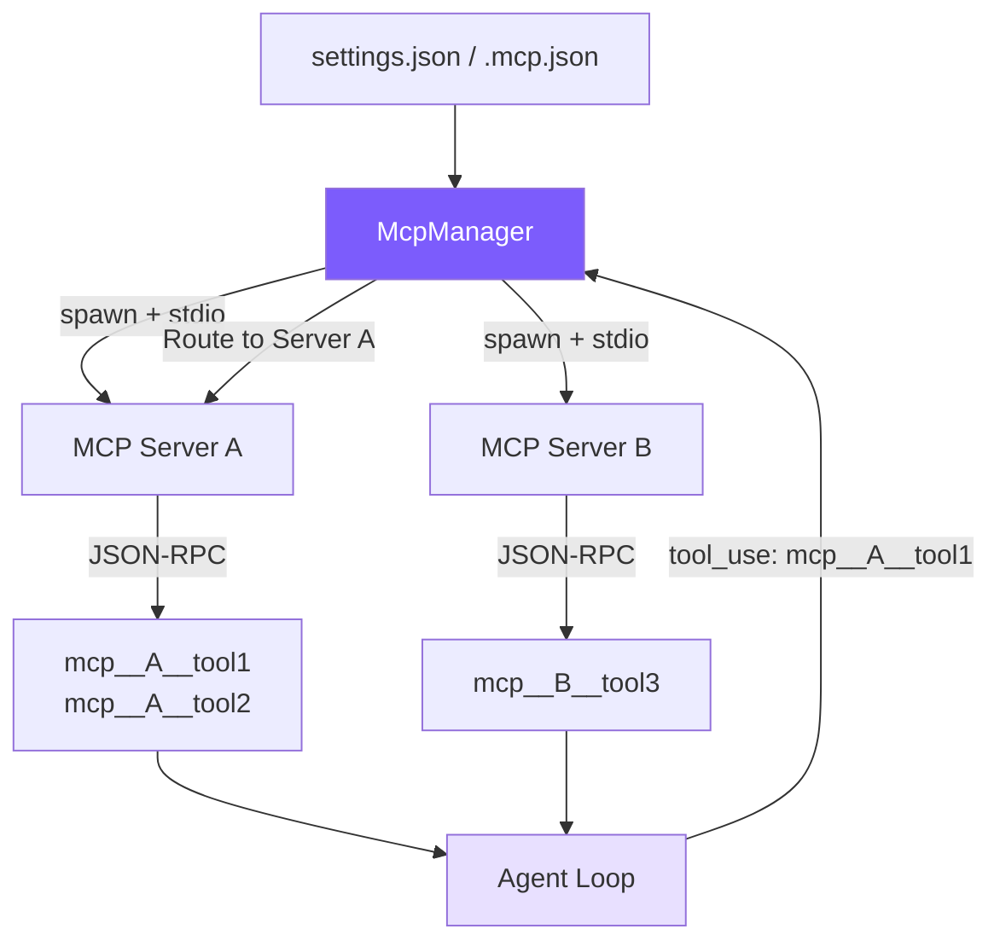

# 12. MCP Integration

## Chapter Goals

So far the agent's tools are all hardcoded in `tools.ts` — adding a new one means editing source. This chapter wires up MCP, a protocol that lets the agent mount external tools dynamically.

Declare a server address in config and you can pull in tools from databases, Slack, GitHub, and other services without touching a line of agent code. We build a minimal MCP client: handshake with a server over JSON-RPC over stdio, ask what tools it has, forward the model's calls to it, and bring the results back.



> ▶ **Run this chapter**: `node steps/run.mjs 12` (no API key) — watch the model call an `add` tool from an external MCP server. Add `--diff` to see what it added over the previous chapter. To run your own prompt against a real model, add `--live` (it reads the key from `.env`; `--py` runs the Python version).

Core idea: **spawn child process -> JSON-RPC handshake -> discover tools -> register with prefix -> transparent routing**. From the Agent Loop's perspective, MCP tools and built-in tools are indistinguishable -- they're all name + schema + execution function.

## Configuration Format

Users only need to declare MCP servers in a configuration file, and the Agent connects to them and registers their tools automatically on the first chat:

```json
// ~/.claude/settings.json (user-level) or .claude/settings.json (project-level)
{
  "mcpServers": {
    "filesystem": {
      "command": "npx",
      "args": ["@modelcontextprotocol/server-filesystem", "/tmp"],
      "env": {}
    },
    "github": {
      "command": "npx",
      "args": ["@modelcontextprotocol/server-github"],
      "env": {
        "GITHUB_TOKEN": "ghp_xxx"
      }
    }
  }
}
```

You can also use `.mcp.json` in the project root, with the same format. Servers from all three configuration sources are merged and connected together; same-name servers are overridden by later reads.

## Our Implementation

So far the agent's tools are all hardcoded in `tools.ts` — adding a new one means editing source. This chapter wires up MCP, a protocol that lets the agent mount external tools dynamically: declare a server and its tools plug in, without touching a line of agent logic. Relative to last chapter, it adds an `mcp.ts`, and the agent connects to the server on startup, merges its discovered tools (prefixed `mcp__`) into the tool list, and routes calls back to it:

<!-- tabs:start -->
#### **TypeScript**
<!-- @diff file=agent.ts step=12 lang=ts -->
```diff
@@ -6,4 +6,5 @@ import { maybeCompact } from "./context.js";
 import { recallMemories } from "./memory.js";
 import { runSubAgent } from "./subagent.js";
+import { connectMcp, type McpConnection } from "./mcp.js";
 
 const MODEL = process.env.MINI_MODEL || "claude-sonnet-4-5-20250929";
@@ -29,4 +30,5 @@ export class Agent {
   async chat(userText: string): Promise<void> {
     this.messages.push({ role: "user", content: userText });
+    await this.ensureMcp(); // discover external MCP tools before the loop
 
     while (true) {
@@ -36,4 +38,7 @@ export class Agent {
       // Recall memories relevant to what the user just asked, into the prompt.
       system += recallMemories(userText);
+      // Merge in any external MCP tools, prefixed so we can route their calls back.
+      const mcpTools: Anthropic.Tool[] = (this.mcp?.tools || []).map((t) => ({ name: `mcp__demo__${t.name}`, description: t.description, input_schema: t.input_schema as any }));
+      const tools = [...toolDefinitions, ...mcpTools];
       // Build the request once. Passing `tools` is the one line that makes the
       // model tool-aware. Chapter 5 turns the call itself into a stream.
@@ -42,5 +47,5 @@ export class Agent {
         max_tokens: 4096,
         system,
-        tools: toolDefinitions,
+        tools,
         messages: this.messages,
       };
@@ -72,4 +77,13 @@ export class Agent {
           continue;
         }
+        // MCP tools (mcp__server__tool) are routed to the MCP server, not run locally.
+        if (tu.name.startsWith("mcp__")) {
+          // mcp__<server>__<tool> → <tool>; drop the first two "__" segments so a
+          // server name with underscores strips the same way Python's does.
+          const toolName = tu.name.split("__").slice(2).join("__");
+          const output = this.mcp ? await this.mcp.callTool(toolName, tu.input) : "Denied: no MCP server connected.";
+          results.push({ type: "tool_result", tool_use_id: tu.id, content: output });
+          continue;
+        }
         // Plan mode is read-only: writes and shell are denied on top of the gate.
         const blocked = checkPermission(tu.name, tu.input as Record<string, any>) === "deny"
@@ -89,3 +103,9 @@ export class Agent {
   clearHistory(): void { this.messages = []; }
   setMode(m: string): void { this.mode = m; }
+  private mcp: McpConnection | null = null;
+  // Connect to the MCP server named in MINI_MCP_SERVER once, on first use.
+  private async ensureMcp(): Promise<void> {
+    if (this.mcp || !process.env.MINI_MCP_SERVER) return;
+    this.mcp = await connectMcp("node", [process.env.MINI_MCP_SERVER]);
+  }
 }
```
<!-- @enddiff -->
#### **Python**
<!-- @diff file=agent.py step=12 lang=py -->
```diff
@@ -10,4 +10,5 @@ from context import maybe_compact
 from memory import recall_memories
 from subagent import run_sub_agent
+from mcp_client import connect_mcp
 
 MODEL = os.environ.get("MINI_MODEL", "claude-sonnet-4-5-20250929")
@@ -27,4 +28,5 @@ class Agent:
         self.messages: list = []
         self.mode = "default"  # "plan" makes the agent read-only
+        self.mcp = None
 
     # One user turn. Call the model; if it asks for tools, run them and feed the
@@ -33,4 +35,5 @@ class Agent:
     def chat(self, user_text: str) -> None:
         self.messages.append({"role": "user", "content": user_text})
+        self._ensure_mcp()  # discover external MCP tools before the loop
 
         while True:
@@ -40,5 +43,8 @@ class Agent:
             # Recall memories relevant to what the user just asked, into the prompt.
             system += recall_memories(user_text)
-            tools = tool_definitions
+            # Merge in any external MCP tools, prefixed so we can route their calls back.
+            mcp_tools = [{"name": f"mcp__demo__{t['name']}", "description": t["description"], "input_schema": t["input_schema"]}
+                         for t in (self.mcp.tools if self.mcp else [])]
+            tools = tool_definitions + mcp_tools
             kwargs = dict(model=MODEL, max_tokens=4096, system=system, tools=tools, messages=self.messages)
 
@@ -68,4 +74,12 @@ class Agent:
                     results.append({"type": "tool_result", "tool_use_id": tu.id, "content": summary})
                     continue
+                # MCP tools (mcp__server__tool) go to the MCP server, not run locally.
+                if tu.name.startswith("mcp__"):
+                    # mcp__<server>__<tool> -> <tool>; drop the first two "__"
+                    # segments so it strips the same way the TypeScript side does.
+                    tool_name = "__".join(tu.name.split("__")[2:])
+                    output = self.mcp.call_tool(tool_name, tu.input) if self.mcp else "Denied: no MCP server connected."
+                    results.append({"type": "tool_result", "tool_use_id": tu.id, "content": output})
+                    continue
                 # Plan mode is read-only: writes and shell are denied on top of the gate.
                 blocked = check_permission(tu.name, tu.input) == "deny" or (
@@ -87,2 +101,6 @@ class Agent:
     def set_mode(self, m: str) -> None:
         self.mode = m
+    # Connect to the MCP server named in MINI_MCP_SERVER once, on first use.
+    def _ensure_mcp(self):
+        if self.mcp is None and os.environ.get("MINI_MCP_SERVER"):
+            self.mcp = connect_mcp("node", [os.environ["MINI_MCP_SERVER"]])
```
<!-- @enddiff -->
<!-- tabs:end -->

The MCP client is just "spawn the server subprocess, handshake over JSON-RPC on its stdio, discover tools, call tools" — the essence of MCP (real MCP has more transports and auth; here we keep stdio only):

<!-- tabs:start -->
#### **TypeScript**
<!-- @snippet lang=ts file=mcp.ts region=mcp step=12 -->
```typescript
export async function connectMcp(command: string, args: string[]): Promise<McpConnection> {
  const proc = spawn(command, args, { stdio: ["pipe", "pipe", "inherit"] });
  const rl = createInterface({ input: proc.stdout! });
  let nextId = 1;
  const pending = new Map<number, (v: any) => void>();
  rl.on("line", (line) => {
    try { const msg = JSON.parse(line); if (msg.id && pending.has(msg.id)) { pending.get(msg.id)!(msg); pending.delete(msg.id); } } catch {}
  });
  const request = (method: string, params?: unknown) =>
    new Promise<any>((resolve) => {
      const id = nextId++;
      pending.set(id, resolve);
      proc.stdin!.write(JSON.stringify({ jsonrpc: "2.0", id, method, params }) + "\n");
    });

  await request("initialize", { protocolVersion: "2024-11-05", capabilities: {}, clientInfo: { name: "mini-claude", version: "1.0" } });
  proc.stdin!.write(JSON.stringify({ jsonrpc: "2.0", method: "notifications/initialized" }) + "\n");
  const listed = await request("tools/list");
  const tools: McpTool[] = (listed.result?.tools || []).map((t: any) => ({ name: t.name, description: t.description || "", input_schema: t.inputSchema }));

  return {
    tools,
    async callTool(name, args) {
      const r = await request("tools/call", { name, arguments: args });
      const content = r.result?.content || [];
      return content.filter((c: any) => c.type === "text").map((c: any) => c.text).join("") || JSON.stringify(r.result ?? r.error);
    },
    close() { proc.kill(); },
  };
}
```
<!-- @endsnippet -->
#### **Python**
<!-- @snippet lang=py file=mcp_client.py region=mcp step=12 -->
```python
class McpConnection:
    def __init__(self, command, args):
        self.proc = subprocess.Popen([command, *args], stdin=subprocess.PIPE,
                                     stdout=subprocess.PIPE, text=True, bufsize=1)
        self._id = 0
        self._lock = threading.Lock()

    def _request(self, method, params=None):
        with self._lock:
            self._id += 1
            rid = self._id
            self.proc.stdin.write(json.dumps({"jsonrpc": "2.0", "id": rid, "method": method, "params": params or {}}) + "\n")
            self.proc.stdin.flush()
            while True:
                line = self.proc.stdout.readline()
                if not line:
                    return {}
                msg = json.loads(line)
                if msg.get("id") == rid:
                    return msg

    def _notify(self, method):
        self.proc.stdin.write(json.dumps({"jsonrpc": "2.0", "method": method}) + "\n")
        self.proc.stdin.flush()

    def connect(self):
        self._request("initialize", {"protocolVersion": "2024-11-05", "capabilities": {}, "clientInfo": {"name": "mini-claude", "version": "1.0"}})
        self._notify("notifications/initialized")
        listed = self._request("tools/list")
        self.tools = [{"name": t["name"], "description": t.get("description", ""), "input_schema": t.get("inputSchema")}
                      for t in listed.get("result", {}).get("tools", [])]
        return self

    def call_tool(self, name, args):
        r = self._request("tools/call", {"name": name, "arguments": args})
        content = r.get("result", {}).get("content", [])
        text = "".join(c.get("text", "") for c in content if c.get("type") == "text")
        return text or json.dumps(r.get("result") or r.get("error"))

    def close(self):
        self.proc.terminate()


def connect_mcp(command, args):
    return McpConnection(command, args).connect()
```
<!-- @endsnippet -->
<!-- tabs:end -->

Run it: connect an example MCP server offering an `add` tool, the model calls `mcp__demo__add(17, 25)`, and the server computes 42:

<!-- @transcript step=12 lang=ts -->
```
$ node steps/run.mjs 12
▶ step 12 demo (no API key — local mock model)   sandbox: <sandbox>
  you: Use the add tool to compute 17 + 25.


  → mcp__demo__add({"a":17,"b":25})
17 + 25 = 42.
```
<!-- @endtranscript -->

> That is the whole runnable step for this chapter — everything `node steps/run.mjs` actually executes here is above. Below is how the repo's production mini-claude does the same thing in full: more edge cases and engineering detail. Read it as an **optional deep-dive**; it is not the code the runnable step runs.

This chapter's runnable-step `mcp.ts` is only **~43 lines**, showing the shortest path through stdio JSON-RPC. The repo's production `src/mcp.ts` is about **277 lines**, adding config loading, multiple servers, timeouts, and error handling — but it is still not a complete MCP implementation: no SSE transport, OAuth, or dynamic refresh. Neither version depends on an MCP SDK, so readers see the protocol itself.

| Claude Code | Our Implementation | Simplification Reason |
|-------------|-------------------|----------------------|
| `@anthropic-ai/sdk` MCP client | Raw JSON-RPC (~100 lines) | No SDK dependency; readers can see protocol details |
| stdio + SSE transports | stdio only | stdio covers 95% of scenarios |
| Dynamic tool refresh | One-time discovery | Tutorial scenarios don't need hot reloading |
| Enterprise policy + 3 config sources | settings.json + .mcp.json | Removed enterprise-level config |
| Retry + fallback | Silently skip failed servers | Simplified error handling |

## Key Code

### 1. MCP Connection -- `McpConnection` Class

Each MCP server corresponds to one `McpConnection` instance, responsible for child process management and JSON-RPC communication.

```typescript
class McpConnection {
  private process: ChildProcess | null = null;
  private nextId = 1;
  private pending = new Map<number, { resolve: (v: any) => void; reject: (e: Error) => void }>();
  private rl: Interface | null = null;

  constructor(private serverName: string, private config: McpServerConfig) {}
```

Three key states: `process` is the child process handle, `pending` is the request-response correlation map (id -> Promise), and `rl` is the readline instance for line-by-line JSON-RPC parsing.

#### Connection and Message Parsing

```typescript
  async connect(): Promise<void> {
    const env = { ...process.env, ...(this.config.env || {}) };
    this.process = spawn(this.config.command, this.config.args || [], {
      stdio: ["pipe", "pipe", "pipe"],
      env,
    });

    // Parse JSON-RPC messages line by line from stdout
    this.rl = createInterface({ input: this.process.stdout! });
    this.rl.on("line", (line: string) => {
      try {
        const msg = JSON.parse(line);
        if (msg.id !== undefined && this.pending.has(msg.id)) {
          const { resolve, reject } = this.pending.get(msg.id)!;
          this.pending.delete(msg.id);
          if (msg.error) {
            reject(new Error(`MCP error ${msg.error.code}: ${msg.error.message}`));
          } else {
            resolve(msg.result);
          }
        }
      } catch {
        // Ignore non-JSON lines (server logs, etc.)
      }
    });
  }
```

The core of stdio mode: the child process's stdin/stdout serve as a bidirectional communication channel, with one JSON-RPC message per line. The `pending` Map uses auto-incrementing ids to correlate requests and responses -- a Promise is stored when sending, then resolved or rejected when the response arrives.

#### Requests and Notifications

JSON-RPC has two message types: **requests** (have an id, expect a response) and **notifications** (no id, fire and forget).

```typescript
  /** Send a request and wait for a response */
  private sendRequest(method: string, params: any = {}): Promise<any> {
    return new Promise((resolve, reject) => {
      if (!this.process?.stdin?.writable) {
        return reject(new Error(`MCP server '${this.serverName}' is not connected`));
      }
      const id = this.nextId++;
      this.pending.set(id, { resolve, reject });
      const msg = JSON.stringify({ jsonrpc: "2.0", id, method, params }) + "\n";
      this.process.stdin.write(msg);
    });
  }

  /** Send a notification, don't wait for a response */
  private sendNotification(method: string, params: any = {}): void {
    if (!this.process?.stdin?.writable) return;
    const msg = JSON.stringify({ jsonrpc: "2.0", method, params }) + "\n";
    this.process.stdin.write(msg);
  }
```

The only difference is the presence or absence of the `id` field. Messages with an `id` are stored in `pending` waiting for a match; messages without an `id` are simply written to stdin and done.

#### Handshake, Discovery, and Invocation

```typescript
  /** MCP initialization handshake */
  async initialize(): Promise<void> {
    await this.sendRequest("initialize", {
      protocolVersion: "2024-11-05",
      capabilities: {},
      clientInfo: { name: "mini-claude", version: "1.0.0" },
    });
    // Send notification to confirm after successful handshake
    this.sendNotification("notifications/initialized");
  }

  /** Discover tools provided by the server */
  async listTools(): Promise<McpToolInfo[]> {
    const result = await this.sendRequest("tools/list");
    if (!result?.tools || !Array.isArray(result.tools)) return [];
    return result.tools.map((t: any) => ({
      name: t.name,
      description: t.description || "",
      inputSchema: t.inputSchema,
      serverName: this.serverName,
    }));
  }

  /** Call a tool and return the text result */
  async callTool(name: string, args: any): Promise<string> {
    const result = await this.sendRequest("tools/call", { name, arguments: args });
    if (result?.content && Array.isArray(result.content)) {
      return result.content
        .filter((c: any) => c.type === "text")
        .map((c: any) => c.text)
        .join("\n");
    }
    return JSON.stringify(result);
  }
```

Three-step standard flow: `initialize` (version negotiation) -> `listTools` (tool discovery) -> `callTool` (execute calls). The MCP protocol requires sending a `notifications/initialized` notification after `initialize` to tell the server that the client is ready.

The return value handling in `callTool` is worth noting: MCP returns `{ content: [{ type: "text", text: "..." }] }` format, and we only extract `text`-type content and concatenate it -- other types like images are not processed for now.

### 2. MCP Manager -- `McpManager` Class

Manages the lifecycle of all MCP connections, providing a unified interface.

#### Configuration Loading

```typescript
export class McpManager {
  private connections = new Map<string, McpConnection>();
  private tools: McpToolInfo[] = [];
  private connected = false;

  private loadConfigs(): Record<string, McpServerConfig> {
    const merged: Record<string, McpServerConfig> = {};

    // 1. User-level: ~/.claude/settings.json
    const globalPath = join(homedir(), ".claude", "settings.json");
    this.mergeConfigFile(globalPath, merged);

    // 2. Project-level: .claude/settings.json
    const projectPath = join(process.cwd(), ".claude", "settings.json");
    this.mergeConfigFile(projectPath, merged);

    // 3. MCP-specific: .mcp.json
    const mcpJsonPath = join(process.cwd(), ".mcp.json");
    this.mergeConfigFile(mcpJsonPath, merged);

    return merged;
  }

  private mergeConfigFile(filePath: string, target: Record<string, McpServerConfig>): void {
    if (!existsSync(filePath)) return;
    try {
      const raw = JSON.parse(readFileSync(filePath, "utf-8"));
      const servers = raw.mcpServers || raw;  // .mcp.json may be a flat server mapping
      for (const [name, config] of Object.entries(servers)) {
        if (this.isValidConfig(config)) {
          target[name] = config as McpServerConfig;
        }
      }
    } catch {
      // Silently skip malformed config files
    }
  }
```

Three configuration sources are read and merged sequentially; same-name servers are overridden by later reads. The `raw.mcpServers || raw` line handles two formats: the nested `mcpServers` structure in `settings.json` and the flat structure in `.mcp.json`.

#### Connection and Discovery

```typescript
  async loadAndConnect(): Promise<void> {
    if (this.connected) return;  // Idempotent: multiple calls only connect once
    this.connected = true;

    const configs = this.loadConfigs();
    if (Object.keys(configs).length === 0) return;

    const TIMEOUT_MS = 15_000;

    for (const [name, config] of Object.entries(configs)) {
      const conn = new McpConnection(name, config);
      try {
        await conn.connect();
        // Both handshake and tool discovery have 15-second timeouts
        await Promise.race([
          conn.initialize(),
          new Promise((_, rej) => setTimeout(() => rej(new Error("timeout")), TIMEOUT_MS)),
        ]);
        const serverTools = await Promise.race([
          conn.listTools(),
          new Promise<McpToolInfo[]>((_, rej) => setTimeout(() => rej(new Error("timeout")), TIMEOUT_MS)),
        ]);
        this.connections.set(name, conn);
        this.tools.push(...serverTools);
        console.error(`[mcp] Connected to '${name}' — ${serverTools.length} tools`);
      } catch (err: any) {
        console.error(`[mcp] Failed to connect to '${name}': ${err.message}`);
        conn.close();  // Clean up failed connections immediately; don't affect other servers
      }
    }
  }
```

`Promise.race` combined with `setTimeout` implements timeouts. Why 15 seconds? MCP servers often start via `npx`, which needs to download packages on first run, but we shouldn't wait forever. Each server connects independently; one failure doesn't affect others.

#### Tool Definition Conversion

```typescript
  getToolDefinitions(): Array<{ name: string; description: string; input_schema: any }> {
    return this.tools.map((t) => ({
      name: `mcp__${t.serverName}__${t.name}`,
      description: t.description || `MCP tool ${t.name} from ${t.serverName}`,
      input_schema: t.inputSchema || { type: "object", properties: {} },
    }));
  }
```

The key operation: converting raw MCP tool names into three-segment prefixed names. The `filesystem` server's `read_file` tool becomes `mcp__filesystem__read_file`. The returned format directly conforms to the Anthropic API's tool definition spec and can be concatenated directly onto the tool list.

#### Routing and Invocation

```typescript
  isMcpTool(name: string): boolean {
    return name.startsWith("mcp__");
  }

  async callTool(prefixedName: string, args: any): Promise<string> {
    // mcp__serverName__toolName → serverName, toolName
    const parts = prefixedName.split("__");
    if (parts.length < 3) throw new Error(`Invalid MCP tool name: ${prefixedName}`);
    const serverName = parts[1];
    const toolName = parts.slice(2).join("__");  // Tool name might contain __
    const conn = this.connections.get(serverName);
    if (!conn) throw new Error(`MCP server '${serverName}' not connected`);
    return conn.callTool(toolName, args);
  }
```

The routing logic is very concise: extract the server name and tool name from the prefixed name, find the corresponding connection, and forward the call. `parts.slice(2).join("__")` handles the case where the tool name itself might contain `__` (rare, but the protocol doesn't prohibit it).

### 3. Agent Integration

MCP's impact on the Agent Loop is minimal -- only two changes.

#### Lazy Loading on First Chat

```typescript
// agent.ts — beginning of chat() method
if (!this.mcpInitialized && !this.isSubAgent) {
  this.mcpInitialized = true;
  try {
    await this.mcpManager.loadAndConnect();
    const mcpDefs = this.mcpManager.getToolDefinitions();
    if (mcpDefs.length > 0) {
      this.tools = [...this.tools, ...mcpDefs as ToolDef[]];
    }
  } catch (err: any) {
    console.error(`[mcp] Init failed: ${err.message}`);
  }
}
```

Three design decisions:

1. **Lazy loading** (on first chat, not in the constructor): The user might just want to ask a quick question and doesn't need to pay the MCP connection startup cost
2. **Only load in the main Agent**: MCP tools are appended to the main Agent at runtime; ordinary sub-agents use their own configured tool set, so they neither connect to MCP nor inherit these tools
3. **Failure doesn't crash**: MCP connection failures only produce log output; the Agent continues working with built-in tools

#### Tool Call Routing

```typescript
// agent.ts — executeToolCall() method
private async executeToolCall(name: string, input: Record<string, any>): Promise<string> {
  if (name === "enter_plan_mode" || name === "exit_plan_mode") return await this.executePlanModeTool(name);
  if (name === "agent") return this.executeAgentTool(input);
  if (name === "skill") return this.executeSkillTool(input);
  // MCP tools: prefix match, forward to McpManager
  if (this.mcpManager.isMcpTool(name)) return this.mcpManager.callTool(name, input);
  return executeTool(name, input, this.readFileState);
}
```

One `if` check, one forwarding call. MCP tools are completely transparent to the Agent Loop -- the model sees `mcp__filesystem__read_file`, issues a tool_use call, gets a text result back, with absolutely no difference from built-in tools.

## What the Real Claude Code Does Beyond This

Our MCP client supports just one transport, stdio, which is enough for local servers. Claude Code supports multiple transports and OAuth, so it can reach remote servers and ones that need authentication.

MCP (Model Context Protocol) is an open protocol released by Anthropic for connecting AI assistants to external tools. Key aspects of Claude Code's MCP implementation:

**Configuration discovery**: Reads server configuration from three locations -- `settings.json` (user-level and project-level) and `.mcp.json` (project root), with later reads overriding earlier ones. Enterprise deployments also support MDM policy distribution.

**Transport protocols**: Supports two transport methods -- stdio (child process communication) and SSE (HTTP long-polling). stdio is the mainstream choice; SSE is used for remote services.

**Tool naming**: All MCP tools are registered in `mcp__serverName__toolName` format. This three-segment naming scheme simultaneously solves naming conflicts and routing -- you can tell from the name alone which server to forward to.

**Connection lifecycle**: spawn process -> `initialize` handshake (exchange version and capabilities) -> `notifications/initialized` confirmation -> `tools/list` tool discovery -> ready. Both initialization and tool discovery have 15-second timeouts.

**Dynamic refresh**: Claude Code supports runtime tool re-discovery (servers can notify the client that the tool list has changed); we simplify to one-time discovery.

**SDK dependency**: Claude Code uses the `@anthropic-ai/sdk` built-in MCP client, which wraps JSON-RPC details. We implement raw JSON-RPC directly, with no MCP SDK dependency.

## Key Design Decisions

### Why JSON-RPC over stdio Instead of HTTP?

The advantage of stdio is **zero configuration**: no port management needed, no service discovery, and the process lifecycle is automatically tied to the parent process. When the child process exits, all pending requests are automatically rejected -- no connection leaks. An HTTP approach would need to handle port conflicts, process discovery, and heartbeat detection -- an order of magnitude more complex.

### Why Three-Segment Prefixed Names (`mcp__server__tool`)?

One name solves two problems simultaneously: **avoiding conflicts** (different servers may have same-named tools) and **embedding routing information** (the server name is extracted directly from the name, with no need for an additional mapping table). Claude Code uses the exact same naming scheme.

### Why a 15-Second Timeout?

MCP servers often start via `npx`, which needs to download npm packages on first run, typically taking 3-8 seconds. 15 seconds is enough to cover most cases without making users wait too long. After a timeout, the server is silently skipped, and the Agent continues working with other available tools.

### Why Lazy Connection (on First Chat Rather Than Startup)?

A user might start the Agent just to ask "what does this function mean?" without needing MCP tools at all. Lazy connection makes this scenario zero-overhead. The trade-off is a few seconds of delay the first time an MCP tool is needed, but this only happens once.

### Why Not Use the MCP SDK?

`@anthropic-ai/sdk` provides an MCP client wrapper, but using raw JSON-RPC directly has two benefits: **zero dependencies** (no added package size) and **educational value** (readers can see the complete protocol details and understand what MCP is actually doing). The entire JSON-RPC communication is only ~60 lines of code, simple enough.

## Simplification Comparison

| Dimension | Claude Code | mini-claude |
|-----------|------------|-------------|
| MCP SDK | `@anthropic-ai/sdk` built-in client | Raw JSON-RPC (no SDK dependency) |
| Server protocol | stdio + SSE | stdio only |
| Tool discovery | Dynamic refresh (server can notify of changes) | One-time discovery |
| Config sources | settings.json + .mcp.json + enterprise policy | settings.json + .mcp.json |
| Error handling | Retry + fallback | Silently skip failed servers |
| Connection timing | Lazy load on first chat | Lazy load on first chat |
| Sub-agent support | Independent MCP connections | Main Agent only; sub-agents don't connect |

---

> **Next chapter**: Full architecture comparison -- from ~5500 lines to 500,000, where's the gap, and what to do next.
